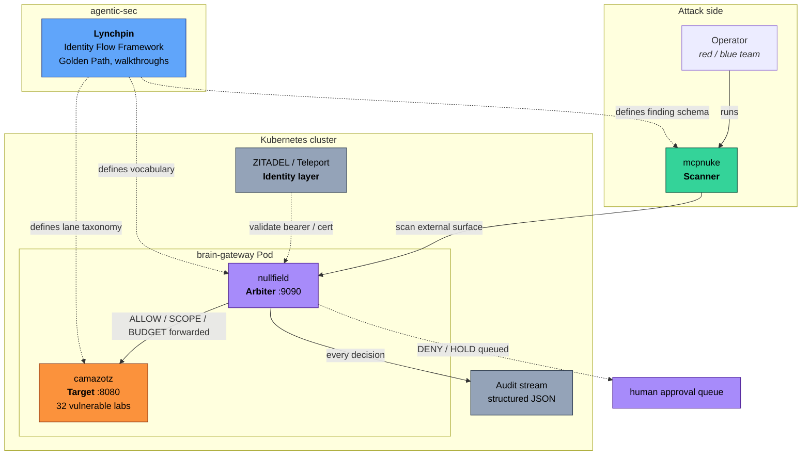
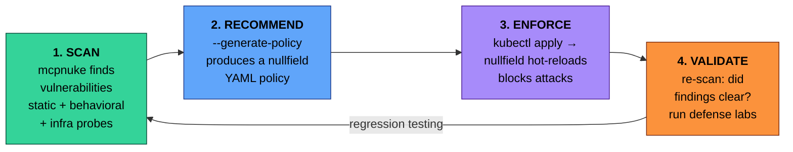
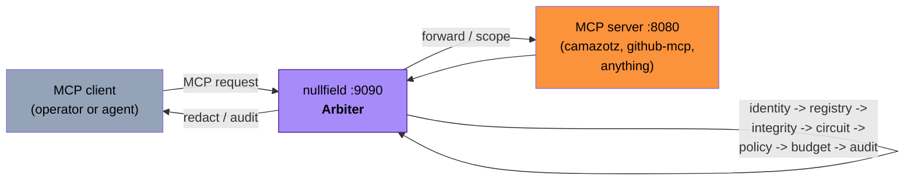
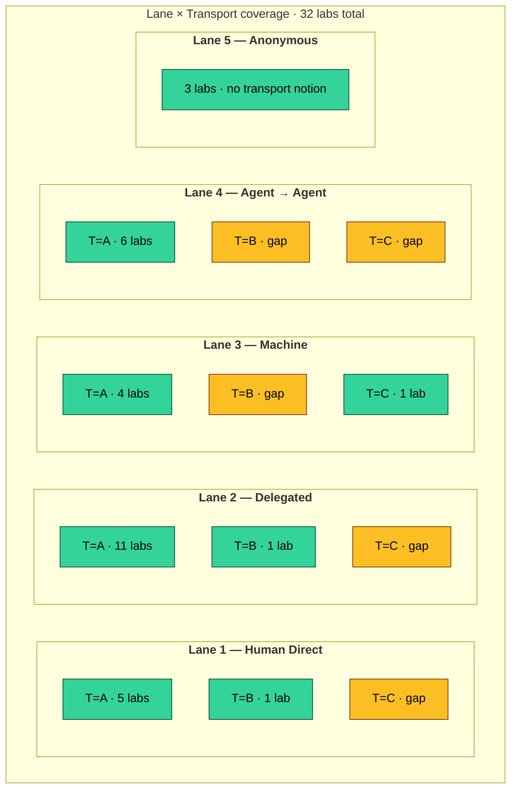

# agentic-security

**Security architecture for agentic infrastructure — MCP tool execution, machine identity, and automated defense.**

A documentation hub and cross-project reference for a closed-loop security stack protecting AI-agent deployments built on the [Model Context Protocol (MCP)](https://modelcontextprotocol.io). Three tightly-coupled projects, one shared vocabulary, one feedback loop.

<p align="center">
  <a href="LICENSE"></a>
  <a href="https://github.com/babywyrm/camazotz"></a>
  <a href="https://github.com/babywyrm/nullfield"></a>
  <a href="https://github.com/babywyrm/mcpnuke"></a>
  <a href="docs/identity-flows.md"></a>
</p>

---

## Table of Contents

- [The Three Projects at a Glance](#the-three-projects-at-a-glance)
- [The Problem](#the-problem)
- [The Architecture — One Ecosystem, Four Roles](#the-architecture--one-ecosystem-four-roles)
- [The Feedback Loop — Scan → Recommend → Enforce → Validate](#the-feedback-loop--scan--recommend--enforce--validate)
- [Deep Dives](#deep-dives)
  - [camazotz — The Vulnerable Target](#camazotz--the-vulnerable-target)
  - [nullfield — The Arbiter](#nullfield--the-arbiter)
  - [mcpnuke — The Scanner](#mcpnuke--the-scanner)
  - [agentic-sec — The Lynchpin (this repo)](#agentic-sec--the-lynchpin-this-repo)
- [Per-Lane Coverage Matrix](#per-lane-coverage-matrix)
- [Quick Start](#quick-start)
- [Documentation](#documentation)
- [Walkthroughs](#walkthroughs)
- [Who This Is For](#who-this-is-for)
- [Roadmap](#roadmap)
- [License](#license)

---

## The Three Projects at a Glance

| Project | Role | What it is | Scale today |
|---------|------|-----------|-------------|
| **[camazotz](https://github.com/babywyrm/camazotz)** | The vulnerable *target* | Intentionally vulnerable MCP server covering every OWASP MCP Top 10 risk, organized by identity lane | **35 labs**, 5 lanes, 5 transports, 86 tools |
| **[nullfield](https://github.com/babywyrm/nullfield)** | The *arbiter* | Sidecar proxy in front of any MCP server — the per-call policy layer the LLM cannot override | **5 actions**, 3 new per-rule primitives (2026-04-26) |
| **[mcpnuke](https://github.com/babywyrm/mcpnuke)** | The *scanner* | Outside-in MCP security scanner — static, behavioral, and infrastructure probes plus exploit chains | Scan modes: `--fast`, `--no-invoke`, `--claude`; outputs JSON + nullfield policy |
| **[agentic-sec](https://github.com/babywyrm/agentic-sec)** | The *lynchpin* | This repo — the framework, the vocabulary, the docs, the walkthroughs | [Identity Flow Framework](docs/identity-flows.md), 6 walkthroughs, golden-path architecture |

Each project ships independently and is usable on its own. They are more powerful together.

---

## The Problem

AI agents call tools. Tools have side effects. The AI cannot be trusted to make security decisions.

Every `tools/call` in an MCP deployment is a remote procedure invocation triggered by a large language model. The LLM can be manipulated by prompt injection, confused-deputy attacks, and social engineering — yet most MCP servers forward tool calls unconditionally. There is no policy layer, no identity verification, and no audit trail.

Three foundational failures compound:

1. **LLM guardrails are advisory, not enforceable.** The model can warn about a dangerous action in its reasoning while the underlying tool logic executes it.
2. **Static API keys provide no identity.** You cannot distinguish a human operator from a compromised agent from a replayed token.
3. **Tool execution has no policy layer.** Without an arbiter, any registered tool call is forwarded to the upstream server unconditionally.

The defense stack described here addresses all three, and provides a way to *measure* whether it's working.

---

## The Architecture — One Ecosystem, Four Roles



**The insight:** each role is separable. You can run camazotz without nullfield (to study vulnerabilities bare). You can run nullfield in front of any MCP server (not just camazotz). mcpnuke scans any target, with or without defense. They compose into a testable whole — and that testability is the point.

---

## The Feedback Loop — Scan → Recommend → Enforce → Validate



**One command runs the full cycle** (see [`scripts/feedback-loop.sh`](scripts/feedback-loop.sh)):

```bash
# Local (advisory mode — generates policy, does not apply)
./scripts/feedback-loop.sh http://localhost:8080/mcp

# Kubernetes (applies as NullfieldPolicy CRD, hot-reloads the sidecar)
./scripts/feedback-loop.sh http://<NODE_IP>:30080/mcp --k8s camazotz

# With Claude AI analysis on top
ANTHROPIC_API_KEY=sk-ant-... ./scripts/feedback-loop.sh http://localhost:8080/mcp --claude
```

Detail in [`docs/feedback-loop.md`](docs/feedback-loop.md).

---

## Deep Dives

### camazotz — The Vulnerable Target

> **[babywyrm/camazotz](https://github.com/babywyrm/camazotz)** — 32 labs, 5 identity lanes, 3 transport surfaces

**What it covers (today):**

| Capability | Detail |
|------------|--------|
| Identity lanes covered | 1. Human Direct · 2. Human→Agent · 3. Machine · 4. Agent→Agent · 5. Anonymous |
| Transport surfaces | A (MCP JSON-RPC) · B (Direct HTTP API) · C (SDK) |
| Lab catalog | 32 intentionally vulnerable labs mapped to OWASP MCP Top 10 |
| Difficulty levels | Easy · Medium · Hard — each level exercises a different defense |
| Identity providers | ZITADEL (live OIDC + token exchange) · Teleport (machine ID) · Mock (deterministic offline) |
| Browsing | `/threat-map` (by attack category) · `/lanes` (by identity flow) |
| Machine-readable taxonomy | `GET /api/lanes` — schema v1 JSON contract |
| Observability | Structured telemetry, observer sidecar, operator console with guided walkthroughs |

**What it does NOT cover (by design):**

- Runtime attack blocking. Camazotz is the *target*. Blocking is nullfield's job.
- Policy generation from findings. Camazotz doesn't scan itself. mcpnuke does.
- Identity issuance. It *consumes* tokens/certs from ZITADEL and Teleport; it doesn't issue them.
- Long-term audit storage. Observer is a demonstration sidecar, not a SIEM.

**The canonical surface** other projects consume:

```bash
# Machine-readable lane taxonomy for mcpnuke + nullfield
curl -s http://<camazotz>:3000/api/lanes | jq '.schema, .lanes | length, .labs | length'
# "v1"
# 5
# 32
```

**Coverage gaps surfaced by camazotz itself** (as teaching artifacts, not bugs):

- Lane 1 — Human Direct: ✅ all three baseline transports A/B/C covered (`sdk_tamper_lab` MCP-T33); D/E gap
- Lane 2 — Delegated: A/B/E covered (`function_calling_lab` MCP-T35); C/D gap
- Lane 3 — Machine: A/C/D covered (`subprocess_lab` MCP-T34); B/E gap
- Lane 4 — Agent → Agent: A only — widest open lane (B/C/D/E all gap)
- Lane 5 — Anonymous: no transport notion (pre-auth, by design)
- **Transports D (subprocess) and E (native LLM function-calling)** ratified 2026-04-28 and validated 2026-04-29 by two spike labs. See [camazotz ADR 0001](https://github.com/babywyrm/camazotz/blob/main/docs/adr/0001-five-transport-taxonomy.md).

See the live coverage grid in [`docs/identity-flows.md`](docs/identity-flows.md#camazotz--per-lane-lab-coverage).

**Quick reference:** [`docs/reference/camazotz.md`](docs/reference/camazotz.md)

---

### nullfield — The Arbiter

> **[babywyrm/nullfield](https://github.com/babywyrm/nullfield)** — 5 actions, 3 new per-rule primitives (2026-04-26)

**The five actions**, composable per tool call:

| Action | What happens | Example |
|--------|-------------|---------|
| **ALLOW** | Forward immediately | Read-only status checks |
| **DENY** | Reject immediately | Exfiltration tools, unregistered tools |
| **HOLD** | Park for human approval | Production deployments, agent delegation past depth 2 |
| **SCOPE** | Allow but modify in transit | Strip secrets from args; redact token-shaped values from responses |
| **BUDGET** | Allow but enforce quotas | Per-identity call limits, token-cost caps |

**Three new per-rule primitives** shipped 2026-04-26 ([spec](https://github.com/babywyrm/nullfield/blob/main/docs/specs/2026-04-26-per-lane-policy-templates.md)):

| Primitive | Enforces | RFC |
|-----------|----------|-----|
| `rules[].identity.requireActChain` | Caller must present a delegation chain (`act` claim). Blocks agents that pass end-user tokens directly on Lane 2 / Lane 4 flows. | RFC 8693 |
| `rules[].identity.audienceMustNarrow` | Each delegation hop's audience must be a subset of the parent's. Catches the `oauth_delegation_lab` confusion pattern. | RFC 8707 |
| `rules[].delegation.maxDepth` | Bounds act-chain depth. `ALLOW <=2 / HOLD @ 3 / DENY (default)` is the canonical Lane 4 pattern. | RFC 8693 |

**Per-lane starter templates** ship in [`policies/by-lane/`](https://github.com/babywyrm/nullfield/tree/main/policies/by-lane):

```
lane-1-human.yaml       ALLOW + audit, OIDC + PKCE
lane-2-delegated.yaml   SCOPE + audit, requireActChain + audienceMustNarrow
lane-3-machine.yaml     SCOPE + bindToSession + detectReplay (SPIFFE/Teleport)
lane-4-chain.yaml       ALLOW<=2 / HOLD@3 / DENY>3 with maxDepth
lane-5-anonymous.yaml   DENY (allowlist only)
```

Copy the file matching your workload's lane, narrow the tool list, and `kubectl apply`.

**What it covers (today):**

- Per-tool-call policy enforcement (the five actions above)
- Identity verification — JWT/OIDC via JWKS, cert-based via Teleport, session binding, replay detection
- Response redaction via regex patterns (`scope.response.redactPatterns`)
- Circuit breaker (max calls per duration)
- Budget accounting per identity / per session
- Structured audit (every decision logged as JSON)
- Kubernetes-native: sidecar, standalone gateway, or auto-injected via mutating admission webhook

**What it does NOT cover (by design):**

- Scanning for new vulnerabilities (mcpnuke's job)
- Generating policies from scratch (mcpnuke's `--generate-policy`)
- IDP issuance (ZITADEL, Okta, Teleport do that)
- Long-term audit storage (emit to your SIEM via OTEL)

**Deployment shape:**



~2ms per-request overhead. Runs as sidecar, standalone, or webhook-injected.

**Quick reference:** [`docs/reference/nullfield.md`](docs/reference/nullfield.md)

---

### mcpnuke — The Scanner

> **[babywyrm/mcpnuke](https://github.com/babywyrm/mcpnuke)** — outside-in MCP security scanner

**Four kinds of analysis**, composable:

| Kind | What it does | When to use |
|------|-------------|-------------|
| **Static** | Examines tool definitions, schemas, metadata for dangerous patterns — credential params, execution capabilities, webhook registration, supply-chain risks. No tool calls. | Every scan. `--no-invoke` flag. |
| **Behavioral** | Calls tools with safe payloads, analyzes responses for injection vectors, credential leakage, temporal inconsistencies, cross-tool manipulation. | After static, when you have a running target. |
| **Infrastructure** | Probes the surrounding infra for misconfigurations — Teleport proxy discovery, self-signed certs, pre-auth app enumeration, tbot credential exposure, over-privileged bot SAs. | Production-adjacent audits. `--teleport` flag. |
| **Exploit chains** | Chains multiple lab tools into complete attack sequences (bot identity theft, role escalation, cert replay). Reports whether the attack succeeded or the defense held. | After nullfield is deployed — to prove defenses hold. |

**Example exploit chains** against camazotz:

| Chain | Tools in sequence | Tests |
|-------|-------------------|-------|
| Bot identity theft | `read_tbot_secret` → `replay_identity` → `check_session_binding` | MCP-T18 — credential theft and replay |
| Role escalation | `get_current_roles` → `request_role` → `privileged_operation` | MCP-T28 — RBAC bypass via social engineering |
| Cert replay | `get_expired_cert` → `replay_cert` → `check_replay_detection` | MCP-T19 — short-lived cert revocation gap |

**Two new CLI flags** shipping 2026-04-26 ([spec](https://github.com/babywyrm/mcpnuke/blob/main/docs/specs/2026-04-26-by-lane-reporting.md)):

- `--by-lane` — group findings by identity lane (1-5) with per-lane severity tallies and a "checks fired / checks defined" coverage fraction.
- `--coverage-report <camazotz-url>` — fetch `/api/lanes` schema v1 from a target camazotz instance and emit a cross-project coverage report intersecting mcpnuke's finding catalog with camazotz's lane distribution. The *ecosystem-level* report.

**What it covers (today):**

- MCP protocol surface: `initialize`, `tools/list`, `tools/call`, `resources/list`, `prompts/list`
- OIDC discovery, scope analysis, token introspection probes
- Teleport infrastructure: proxy discovery, cert validation, bot over-privilege
- Policy generation: `--generate-policy <fix.yaml>` emits a ready-to-apply nullfield policy from findings
- Baselining: `--save-baseline`, `--baseline` for regression detection
- AI-powered analysis: `--claude` for deep attack-chain reasoning

**What it does NOT cover (by design):**

- Runtime request blocking. Pure scanner — observes, reports, recommends.
- Policy application. mcpnuke writes the YAML; `kubectl apply` / `make helm-deploy` actually applies it.
- Long-term finding storage. JSON output streams into your existing security tooling.
- Identity issuance. Uses provided tokens if present; scanner is agnostic.

**Quick reference:** [`docs/reference/mcpnuke.md`](docs/reference/mcpnuke.md)

---

### agentic-sec — The Lynchpin (this repo)

> **[babywyrm/agentic-sec](https://github.com/babywyrm/agentic-sec)** — the framework and the vocabulary

Three things this repo owns, and nothing else:

1. **The Identity Flow Framework** ([`docs/identity-flows.md`](docs/identity-flows.md)) — five lanes × five transports (extended from three on 2026-04-28; see [camazotz ADR 0001](https://github.com/babywyrm/camazotz/blob/main/docs/adr/0001-five-transport-taxonomy.md)), the lens every other doc is written through. The canonical slugs (`human-direct`, `delegated`, `machine`, `chain`, `anonymous`) and transport codes (`A`/`B`/`C`/`D`/`E`) used verbatim by camazotz/nullfield/mcpnuke.
2. **The Golden Path** ([`docs/golden-path.md`](docs/golden-path.md)) — production security architecture for MCP deployments. Identity, registry, policy, audit. Written for security review boards.
3. **Walkthroughs** ([`docs/walkthroughs/`](docs/walkthroughs/)) — six guided exercises covering attack, defense, lab practice, AI-powered scanning, live feedback loop, and delegation chain attacks.

**What this repo does NOT contain:**

- Code. It's strictly documentation plus the [`scripts/feedback-loop.sh`](scripts/feedback-loop.sh) glue.
- Implementation of any defense. That's nullfield's.
- Any deployment targets. Each project's repo has its own deployment.

**If the slugs or codes ever change here, the three consumer repos must move in lockstep.** The vocabulary is the contract.

---

## Per-Lane Coverage Matrix

Live data from camazotz `GET /api/lanes` (schema v1), rendered as a grid. Green cells = lab exists; amber = gap (teaching artifact).



Each lane is paired with a default nullfield action (see [identity-flows.md](docs/identity-flows.md) for the full per-lane table):

| Lane | Default `nullfield` action | Identity provider |
|------|---------------------------|-------------------|
| 1 · Human Direct | `ALLOW + audit` | ZITADEL |
| 2 · Delegated | `SCOPE + audit` (with `audienceMustNarrow`) | ZITADEL |
| 3 · Machine | `SCOPE + bindToSession + detectReplay` | Teleport |
| 4 · Agent → Agent | `ALLOW<=2 / HOLD@3 / DENY>3` (`maxDepth`) | ZITADEL + act chain |
| 5 · Anonymous | `DENY` (allowlist only) | n/a |

---

## Quick Start

### Option 1 — Local Docker Compose (fastest)

```bash
# Start the vulnerable target
git clone https://github.com/babywyrm/camazotz && cd camazotz
make env && make up

# Scan it (static scan, no tool calls)
pip install mcpnuke
mcpnuke --targets http://localhost:8080/mcp --fast --no-invoke --verbose

# Generate a defense policy from the findings
mcpnuke --targets http://localhost:8080/mcp --fast --no-invoke --generate-policy fix.yaml
cat fix.yaml

# Verify the new agentic lane view
curl -s http://localhost:3000/api/lanes | jq '.lanes | length'  # -> 5
open http://localhost:3000/lanes                                # -> browser
```

### Option 2 — Kubernetes with nullfield in-cluster

```bash
# Deploy camazotz with the nullfield sidecar enabled
cd camazotz
helm upgrade --install camazotz deploy/helm/camazotz \
  --namespace camazotz --create-namespace \
  --set nullfield.enabled=true

# Install the nullfield CRDs (lets policies be expressed as K8s resources)
kubectl apply -f https://raw.githubusercontent.com/babywyrm/nullfield/main/deploy/crds/nullfieldpolicy-crd.yaml
kubectl apply -f https://raw.githubusercontent.com/babywyrm/nullfield/main/deploy/crds/toolregistry-crd.yaml

# Apply a per-lane starter template
kubectl apply -n camazotz \
  -f https://raw.githubusercontent.com/babywyrm/nullfield/main/policies/by-lane/lane-4-chain.yaml

# Scan through nullfield from outside the cluster
export K8S_HOST=<your-node-ip>
mcpnuke --targets http://$K8S_HOST:30080/mcp --fast --no-invoke --generate-policy fix.yaml

# Close the loop
./scripts/feedback-loop.sh http://$K8S_HOST:30080/mcp --k8s camazotz
```

### Option 3 — Full Stack with Teleport

Add machine identity for agents — short-lived certificates, K8s RBAC, MCP tool-level access control. Follow [`docs/teleport/setup.md`](docs/teleport/setup.md).

---

## Documentation

### Architecture

| Document | What it covers |
|----------|---------------|
| [**Identity Flow Framework**](docs/identity-flows.md) | **Foundational.** Five identity lanes × three transport surfaces. The lens every other doc uses. Live coverage grid. |
| [The Ecosystem](docs/ecosystem.md) | How the three projects fit together — defense layers, data flows, per-project coverage scorecard, roadmap |
| [Golden Path](docs/golden-path.md) | Production security architecture for MCP deployments — identity, registry, policy, audit. For security review boards. |
| [The Feedback Loop](docs/feedback-loop.md) | Scan → recommend → enforce → validate — the complete operational cycle |

### Reference

| Document | What it covers |
|----------|---------------|
| [nullfield Quick Reference](docs/reference/nullfield.md) | The five actions, policy YAML, per-lane templates, deployment modes, CRDs |
| [mcpnuke Quick Reference](docs/reference/mcpnuke.md) | Scan modes, Teleport checks, policy generation, baselines, `--by-lane` + `--coverage-report` |
| [camazotz Quick Reference](docs/reference/camazotz.md) | Lab categories, difficulty levels, deployment options, `/api/lanes` schema |

### Deployment & Integration

| Guide | What it covers |
|-------|---------------|
| [Deployment Guide](docs/deployment-guide.md) | Local, cluster, and cloud — performance, brain providers, scan modes per environment |
| [Teleport Setup](docs/teleport/setup.md) | Machine identity for agents — tbot, K8s access, MCP App Access |

---

## Walkthroughs

| Walkthrough | What you'll do | Time |
|------------|---------------|------|
| [1. The Attack](docs/walkthroughs/attack.md) | Scan camazotz with mcpnuke, understand the findings, map attack chains | 30m |
| [2. The Defense](docs/walkthroughs/defense.md) | Generate a nullfield policy from findings, apply it, re-scan to prove it works | 45m |
| [3. Lab Practice](docs/walkthroughs/practice.md) | Work through camazotz defense-mode labs — write policy, craft redaction rules, tune budgets | 60m |
| [4. AI-Powered Scanning](docs/walkthroughs/ai-powered-scanning.md) | Wire Claude into both mcpnuke and camazotz — deep reasoning, attack-chain analysis, realistic AI guardrails | 45m |
| [5. Live Feedback Loop](docs/walkthroughs/live-loop.md) | Automated scan → generate → apply → validate cycle with one script | 20m |
| [6. Delegation Chain Attacks](docs/walkthroughs/delegation-chains.md) | Multi-agent identity dilution — Agent A → B → C loses human authorization | 45m |
| [7. Flow Types in Practice](docs/walkthroughs/flow-types-in-practice.md) | **All five lanes end-to-end** — captured output from a live reference deployment, with the `--by-lane` + `--coverage-report` cross-project view | 60m |

---

## Who This Is For

**Security engineers** evaluating how to secure MCP / agentic tool execution in production Kubernetes environments. The architecture docs and golden path are written for security review boards. Start with [Golden Path](docs/golden-path.md).

**Red team operators** testing MCP server defenses. camazotz provides 32 intentionally vulnerable labs; mcpnuke automates the attack sequences. Start with [Walkthrough 1 — The Attack](docs/walkthroughs/attack.md).

**Blue team defenders** learning to write nullfield policy. The defense-mode labs teach policy authoring, response redaction, and budget tuning with scored feedback. Start with [Walkthrough 2 — The Defense](docs/walkthroughs/defense.md) and [Walkthrough 3 — Lab Practice](docs/walkthroughs/practice.md).

**Platform engineers** building agentic infrastructure. The deployment guides cover Docker Compose, Kubernetes, Helm, CRDs, gateway mode, and admission webhook injection. Start with [Deployment Guide](docs/deployment-guide.md).

**Research / standards folks** working on identity-for-AI. The Identity Flow Framework is the formal lens; the camazotz corpus is a reference implementation that can be scanned by third-party tools. Start with [Identity Flow Framework](docs/identity-flows.md).

---

## Roadmap

Three horizons, committed in decreasing order of near-term certainty — detail in [`docs/ecosystem.md#roadmap`](docs/ecosystem.md#roadmap--how-this-grows).

**Near-term (spec'd, implementation in flight):**

- ✅ nullfield per-lane policy templates + three new primitives — *Layer A + B shipped 2026-04-26*
- ✅ mcpnuke `--by-lane` and `--coverage-report` — *shipped 2026-04-26; lane/transport backfilled across 10 check modules*
- ✅ nullfield CRD watcher + active-policy bridge wired into the reference cluster — *shipped 2026-04-27*
- ✅ `sdk_tamper_lab` (Lane 1 / Transport C) — *shipped 2026-04-28; closes Lane 1 baseline transport coverage*
- ✅ Five-transport taxonomy (D = subprocess, E = native LLM function-calling) — *ratified 2026-04-28; see camazotz ADR 0001*
- ✅ `subprocess_lab` (Lane 3 / Transport D) + `function_calling_lab` (Lane 2 / Transport E) — *shipped 2026-04-29; both spike labs validate ADR 0001 buckets are non-degenerate*
- ✅ `docs/identity-flows.md` rewritten to 5×5 matrix with per-transport identity envelopes and standards anchors — *2026-04-29*

**Medium-term (visible work):**

- Fill remaining baseline transport gaps — Lane 2 Transport C, Lane 3 Transport B, Lane 4 Transport B (and C if a coherent threat exists)
- Lane 4 transport widening — agent chains today are all MCP; D and E variants would model real LangChain / OpenAI assistants chains
- Walkthrough: "Lane 4 defense in practice" using `delegation.maxDepth` against `delegation_depth_lab`

**Future (revisit when the three-repo vocabulary diverges):**

- Central machine-readable taxonomy at `agentic-sec/docs/taxonomy/lanes.yaml` — only if drift emerges
- Per-lane rate-limit primitives in nullfield (distinct from global `maxCallsPerMinute`)
- mcpnuke `--watch` mode producing continuous lane-coverage deltas against a long-running camazotz

---

## License

Each project is independently MIT-licensed. This documentation hub is MIT-licensed.

- **camazotz:** [MIT](https://github.com/babywyrm/camazotz/blob/main/LICENSE)
- **nullfield:** [MIT](https://github.com/babywyrm/nullfield/blob/main/LICENSE)
- **mcpnuke:** [MIT](https://github.com/babywyrm/mcpnuke/blob/main/LICENSE)
- **agentic-sec:** [MIT](./LICENSE)
