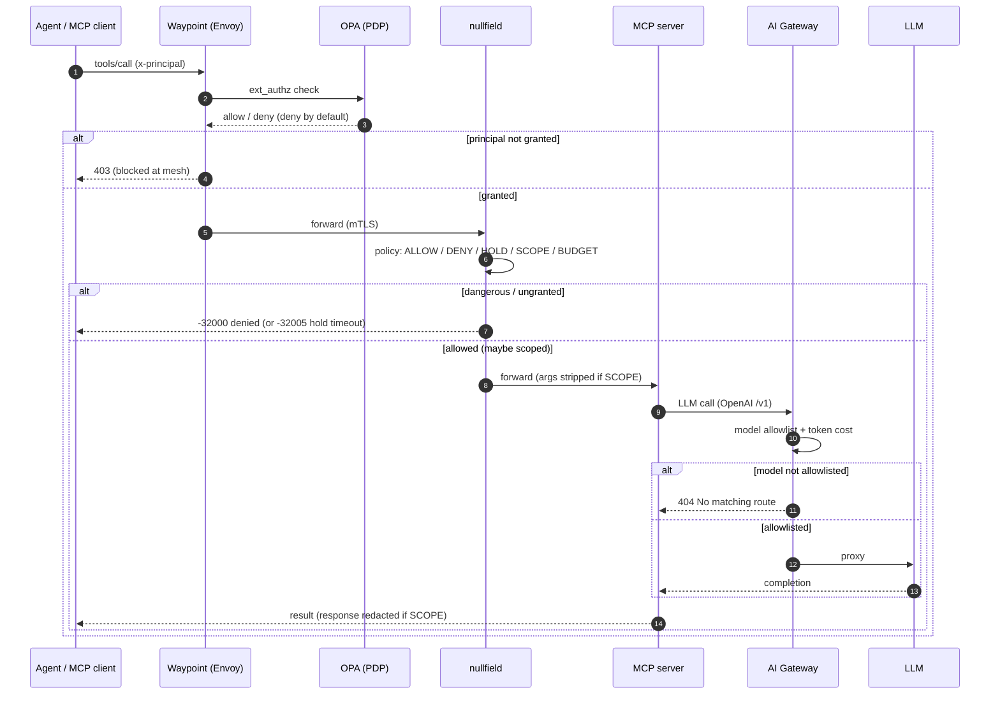
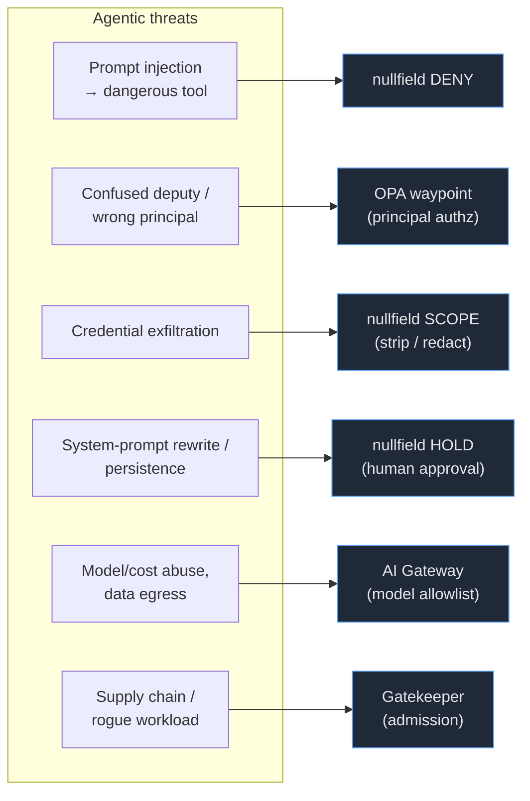

# The Stack — Zero-Trust Agentic Control Plane, end to end

This is the single map of the whole prototype: the layers, what each one
delivers, how they compose, and how to **deploy, test, and watch** it yourself.
For the architectural rationale see [`README.md`](README.md); for the live
status of each topology see [`STATUS.md`](STATUS.md).

> **Thesis.** An agentic system is a mesh of MCP servers where an LLM decides
> which tools to call. The LLM can be injected or social-engineered, so it must
> not be the thing that enforces security. This stack puts **deterministic,
> out-of-band controls** around the agent at every layer that matters — identity,
> admission, network, runtime tool-call authz, and model egress — so the agent
> *advises* and the control plane *decides*.

---

## The layered request path (ASCII)

```
   RUNTIME — every tool call travels this path:

      agent / MCP client
           │   tools/call        (header  x-principal: <id>)
           ▼
   (1) Istio waypoint  ──ext_authz──►  OPA (PDP)      L7 authz · deny-by-default
           │   forwards only on ALLOW                 mutual TLS + workload identity
           ▼
   (2) nullfield  (MCP-aware PEP)                     ALLOW · DENY · HOLD · SCOPE · BUDGET
           │   ALLOW / SCOPE-sanitized                understands the tool call itself
           ▼
   (3) MCP server  (the workload)                     runs the actual tool logic
           │   LLM call          (OpenAI /v1)
           ▼
   (4) Envoy AI Gateway  (egress)                     model allowlist · token cost · cred broker
           │   allowlisted models only
           ▼
      self-hosted LLM  (Ollama / vLLM)

   PERIMETER — enforced before any request runs:
      Gatekeeper    (admission)   blocks non-compliant pods (registry / privilege / labels)
      NetworkPolicy (CNI)         only intended pods can reach the workload
```

Two enforcement points (PEPs) share **one** policy brain. A waypoint does coarse
per-principal authorization; nullfield does the MCP-aware actions a generic L7
proxy can't (hold for approval, strip/redact, budget). Both fail closed.

---

## The layers

| # | Phase | Question it answers | Component | Verify |
|---|-------|---------------------|-----------|--------|
| 1 | **B** | *Can this pod even exist?* | OPA **Gatekeeper** (admission) | `kubectl get constraints -A -o wide` |
| 2 | **C** | *Can these pods talk, only as intended?* | **NetworkPolicy** (CNI) | bypass probe in `verify-stack.sh` |
| 3 | **A** | *Should THIS tools/call run, for this principal?* | Istio waypoint (**Envoy** PEP) + **OPA** (PDP) | `examples/camazotz/verify.sh` |
| 4 | **E** | *Hold? Sanitize? Budget this call?* | **nullfield** (MCP-aware PEP) | `examples/camazotz/nullfield-verify.sh` |
| 5 | **D** | *What model traffic may leave?* | **Envoy AI Gateway** (egress) | `examples/envoy-ai-gateway/verify.sh` |
| 6 | **F** | *Does it actually stop attacks?* | **mcpnuke** (red-team scanner) | `examples/camazotz/mcpnuke-validate.sh` |
| — | (3-identity) | *Who is this workload, really?* | SPIFFE/SPIRE or Teleport | deferred — `manifests/50-identity/` |

---

## What each piece delivers (plain language)

If you read nothing else, read this. One sentence per component, and where it
comes from.

| Component | What it actually delivers | Source |
|-----------|---------------------------|--------|
| **Istio ambient** (ztunnel + waypoint) | Gives every workload a cryptographic identity and mutual TLS automatically, and routes tool calls through an Envoy checkpoint — no app changes. | [istio.io/ambient](https://istio.io/latest/docs/ambient/) |
| **OPA** (Policy Decision Point) | The decision engine. A small Rego policy answers "may THIS principal call THIS tool?" — **deny unless explicitly granted.** | [openpolicyagent.org](https://www.openpolicyagent.org/) |
| **Envoy waypoint** (Policy Enforcement Point) | Asks OPA on *every* request and enforces the answer. A denial returns 403 and the workload is never touched. | [envoyproxy.io](https://www.envoyproxy.io/) |
| **nullfield** (MCP-aware PEP) | Understands the MCP call itself: **allow / deny**, **hold** for human approval, **scope** (strip secret args, redact secret responses), **budget** per identity. | [github.com/babywyrm/nullfield](https://github.com/babywyrm/nullfield) |
| **Envoy AI Gateway** (egress) | The only way model traffic leaves: an **allowlist of models**, per-request token cost, and one place to hold provider credentials. | [aigateway.envoyproxy.io](https://aigateway.envoyproxy.io/) |
| **OPA Gatekeeper** (admission) | Stops non-compliant pods at deploy time — wrong registry, privileged, missing labels — before they ever run. | [open-policy-agent/gatekeeper](https://open-policy-agent.github.io/gatekeeper/) |
| **NetworkPolicy** | An L3/L4 fence: only the intended pods can reach the workload (enforcement depends on the CNI). | [k8s NetworkPolicies](https://kubernetes.io/docs/concepts/services-networking/network-policies/) |
| **camazotz** (the target) | A realistic, LLM-backed vulnerable MCP server (52 OWASP-MCP-Top-10 labs) — what we put the control plane in front of. | [github.com/babywyrm/camazotz](https://github.com/babywyrm/camazotz) |
| **mcpnuke** (validation) | Red-team scanner that proves the controls actually block attacks (before/after). | [github.com/babywyrm/mcpnuke](https://github.com/babywyrm/mcpnuke) |

**The one idea:** the LLM *advises* which tool to call; these layers *decide*
whether it runs. Authorization is deterministic and out-of-band, so prompt
injection or a confused agent can't talk its way past it.

### The vocabulary (PEP / PDP / PAP / PIP)

Authorization architecture uses four standard roles (XACML / NIST SP 800-207).
You'll see **PEP** and **PDP** throughout these docs — here's the whole set,
mapped to the concrete pieces in this blueprint:

| Term | Role | One line | In this stack |
|------|------|----------|---------------|
| **PEP** — Policy **Enforcement** Point | the gate | sits in the request path; asks "may this proceed?" and **enforces** the answer | **Istio waypoint (Envoy)** and **nullfield** |
| **PDP** — Policy **Decision** Point | the brain | evaluates policy and returns allow/deny; no traffic flows through it | **OPA** evaluating [`policy/authz.rego`](policy/authz.rego) |
| **PAP** — Policy **Administration** Point | the rulebook | where policy is authored and version-controlled | the `*.rego` / nullfield policy files in git |
| **PIP** — Policy **Information** Point | the facts | supplies identity/context the PDP needs to decide | `x-principal` header today → verified SPIFFE SVID (Phase 3, `manifests/50-identity/`) |

**PEP blocks, PDP decides — and they're deliberately separate.** That split is
why our waypoint *and* nullfield can both call the *same* OPA PDP (one policy
corpus governs everything; swap the enforcer without touching the rules). See
[`README.md` → "PEP / PDP split"](README.md) for the deeper rationale.

---

## Request flow (Mermaid)



---

## Threats → controls (Mermaid)



---

## Driven agentic flows (verified end-to-end)

Eight representative flows, each decided by the layer that owns its concern
(captured live by `examples/camazotz/drive-flows.py`, rendered by
`observability/report.sh`):

| Flow | Layer | Action | Result |
|------|-------|--------|--------|
| `ci-deployer` → `code_review.run_checks` | OPA waypoint | ALLOW | 200 |
| `unknown` → `get_status` | OPA waypoint | DENY | 403 |
| `ci-deployer` → `chain.get_service_manifest` | nullfield | ALLOW | 200 |
| `attacker` → `egress.fetch_url` | nullfield | DENY | −32000 |
| `ci-deployer` → `cred_broker.read_credential` | nullfield | SCOPE | 200 (sanitized) |
| `attacker` → `config.update_system_prompt` | nullfield | HOLD | −32005 (parked) |
| `agent` → model `qwen3:4b` | AI gateway | ALLOW | 200 |
| `agent` → model `llama3.2:1b` | AI gateway | DENY | 404 |

**Offensive proof (mcpnuke):** the same scan run direct vs through the PEP —
baseline yields executable attack chains; protected shows **285 tool.denied,
32 hold.created, 2 scope.modified, 4 tool.allowed** at runtime.

---

## Worked example: trace a request, hop by hop

Three real requests, exactly as captured by `observability/walk-stack.sh`. The
point is to see precisely what each layer contributes — and where a request
stops.

### 1 · Benign, granted — reaches the tool
`ci-deployer` asks for the service topology (`chain.get_service_manifest`).

| Hop | Layer | Decision | Evidence on the wire |
|-----|-------|----------|----------------------|
| 1 | client | `POST /mcp`, header `x-principal: ci-deployer`, body `tools/call chain.get_service_manifest` | raw request |
| 2 | NetworkPolicy | allow (in-mesh source) | — |
| 3 | waypoint → OPA | **ALLOW** — principal is granted the tool | resp `server: istio-envoy`; OPA `decision_id …` |
| 4 | nullfield | **ALLOW** — tool on allowlist | audit `tool.allowed` |
| 5 | brain-gateway | executes | `200 OK`, topology JSON returned |

> Only explicitly-granted calls ever reach the workload.

### 2 · Credential read — runs, but sanitized
`ci-deployer` calls `cred_broker.read_credential` with `api_key: sk-LEAKME…`.

| Hop | Layer | Decision | Evidence |
|-----|-------|----------|----------|
| 1 | client | body contains `"api_key":"sk-LEAKME1234567890abcdef"` | raw request |
| 2 | waypoint → OPA | ALLOW (principal granted) | — |
| 3 | **nullfield** | **SCOPE** — strips the secret arg before forwarding | audit `scope.modified … stripped=[api_key]` |
| 4 | brain-gateway | executes with the secret **removed** | `200 OK` |

> The secret entered the request and never reached the tool. Response-side
> redaction also strips secret-shaped values on the way back.

### 3 · Attacker, dangerous tool — blocked
`attacker` calls `egress.fetch_url` (SSRF / exfil).

| Hop | Layer | Decision | Evidence |
|-----|-------|----------|----------|
| 1 | client | `x-principal: attacker`, tool `egress.fetch_url` | raw request |
| 2 | waypoint → OPA | reaches the mesh | — |
| 3 | **nullfield** | **DENY** — explicit deny rule | body `-32000 "denied by policy"`; audit `tool.denied` |
| — | brain-gateway | **never invoked** | — |

> Variant — `attacker → config.update_system_prompt` is **HELD** for human
> approval (`hold.created` → `-32005` on timeout) rather than denied outright.

Reproduce any of these live with the raw wire + deciding-layer log:

```bash
NODE=<node-ip> NS=camazotz observability/walk-stack.sh            # all three + more
ONLY=nf-scope NODE=<node-ip> observability/walk-stack.sh          # just the SCOPE strip
```

---

## Deploy it (any cluster: k3s / EKS / kind)

```bash
cd blueprints/zero-trust-control-plane

# 1. mesh control plane (istiod + ztunnel + istio-cni + OPA extensionProvider + OPA PDP)
./deploy.sh ambient

# 2. admission layer (Gatekeeper must be installed first; constraints ship dryrun)
./deploy.sh phase2

# 3. real MCP target behind the waypoint + shared OPA
CAMAZOTZ_DIR=/opt/camazotz LLM_ENDPOINT=http://<model>:11434 ./examples/camazotz/run.sh

# 4. nullfield MCP-aware PEP sidecar
NS=camazotz ./examples/camazotz/nullfield-deploy.sh

# 5. AI egress gateway
LLM_HOST=<model-ip> ./examples/envoy-ai-gateway/run.sh
```

On EKS: build/push images to ECR, drop the k3s istio-cni path overrides in
`deploy.sh ambient`, and point backends at in-cluster Services. See each
example's README "Portability notes".

---

## Test it yourself

One command runs every layer's verifier and prints a consolidated result:

```bash
NODE=<node-ip> NS=camazotz ./verify-stack.sh
```

Or run any layer on its own (all committed, all parameterized):

```bash
NS=camazotz ./examples/camazotz/verify.sh              # Phase A — OPA authz matrix
NS=camazotz ./examples/camazotz/nullfield-verify.sh    # Phase E — 5 nullfield actions
./examples/envoy-ai-gateway/verify.sh                  # Phase D — model allowlist
./examples/camazotz/mcpnuke-validate.sh                # Phase F — offensive before/after
```

---

## Watch it (observability)

```bash
observability/kiali.sh        # live mesh graph (waypoint, mTLS, traffic)
observability/observe.sh      # one decision feed: OPA + nullfield + AI gateway
observability/report.sh flows.json
```

Full map of per-layer surfaces: [`observability/README.md`](observability/README.md).
Agents can drive the same workflow via the
[`zerotrust-observe`](../../.cursor/skills/zerotrust-observe/SKILL.md) skill.

---

## Sources & references

**Upstream components**
- Istio — ambient mode, waypoints, ext_authz: <https://istio.io/latest/docs/ambient/>
- Open Policy Agent (PDP) + opa-envoy-plugin: <https://www.openpolicyagent.org/>
- OPA Gatekeeper (admission): <https://open-policy-agent.github.io/gatekeeper/>
- Envoy Gateway: <https://gateway.envoyproxy.io/> · Envoy AI Gateway: <https://aigateway.envoyproxy.io/>
- nullfield (MCP-aware PEP): <https://github.com/babywyrm/nullfield>
- camazotz (vulnerable MCP target): <https://github.com/babywyrm/camazotz>
- mcpnuke (MCP red-team scanner): <https://github.com/babywyrm/mcpnuke>

**Standards & models**
- NIST SP 800-207 — Zero Trust Architecture
- OWASP MCP Top 10 (2025): <https://owasp.org/www-project-mcp-top-10/>
- SPIFFE / SPIRE — workload identity: <https://spiffe.io/>
- Model Context Protocol: <https://modelcontextprotocol.io/>

**In this repo**
- [`README.md`](README.md) — architecture & rationale · [`STATUS.md`](STATUS.md) — proven / caveats
- [`observability/README.md`](observability/README.md) — per-layer visualization
- [`examples/camazotz/`](examples/camazotz/) · [`examples/envoy-ai-gateway/`](examples/envoy-ai-gateway/)

---

## What's deferred (honest scope)

- **Workload identity (Phase 3)** — today the principal is the `x-principal`
  header (fine to prove the policy path); production replaces it with the
  verified SPIFFE SVID ztunnel already mints, plus on-behalf-of propagation
  across MCP→MCP hops. Design notes: `manifests/50-identity/`.
- **Host-kernel dependency** — Istio's inbound interception relies on a working
  host netfilter stack; some non-standard/custom kernels can't intercept inbound
  (a host issue, not a blueprint flaw). Validate on a standard-kernel cluster —
  see [`STATUS.md`](STATUS.md).
