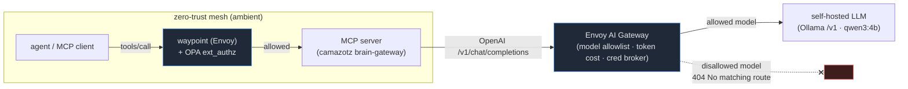

# Example: AI egress layer — Envoy AI Gateway in front of a self-hosted LLM

This is **Phase D** of the zero-trust control plane: the *AI egress* layer —
**"what may leave to model providers?"**. Where the waypoint + OPA gate which
*tool calls* run, the AI Gateway gates which *model calls* leave the cluster.

Every LLM request from an agent / MCP server egresses **through** this gateway,
which enforces:

- **Model allowlist** — only declared models are routable; a request for any
  other model is rejected *even if the backend has it pulled*.
- **Token-cost accounting** — input/output tokens recorded per request in the
  Envoy access log (metadata for rate/budget policy).
- **Single credential-brokering chokepoint** — the upstream key lives in one
  `BackendSecurityPolicy`, injected by the gateway; clients never hold it.

## Where it sits in the stack



| Layer | Question | This example |
|-------|----------|--------------|
| Tool-call authz (runtime) | should THIS tools/call run? | waypoint + OPA (Phase A) |
| **AI egress** | **what model traffic may leave?** | **Envoy AI Gateway (this)** |

## What it proves (verified end-to-end)

```
[ALLOWED] model=qwen3:4b      -> HTTP 200   "GATEWAY OK"   usage: total_tokens=282
[DENIED]  model=llama3.2:1b   -> HTTP 404   "No matching route ... not configured in the Gateway"
```

`llama3.2:1b` **is** pulled in Ollama — but it's not in the gateway's allowlist,
so egress is refused at the control point, not the backend. That's the whole
point: the model catalog an agent can reach is policy, not whatever the backend
happens to host.

## Files

| File | Role |
|------|------|
| `aigw-ollama.yaml` | GatewayClass/Gateway/AIGatewayRoute (allowlist) + AIServiceBackend + Backend + BackendSecurityPolicy |
| `run.sh` | Install Envoy Gateway + Envoy AI Gateway (Helm) and apply the config (parameterized) |
| `verify.sh` | Allowed-vs-denied egress matrix (portable, via port-forward) |

## Run it (any cluster)

```bash
# installs Envoy Gateway + AI Gateway, then applies the Ollama backend + allowlist
LLM_HOST=<ollama-ip> LLM_PORT=11434 ALLOW_MODELS="qwen3:4b" ./run.sh
./verify.sh
```

## Wiring camazotz (or any MCP server) through it

camazotz's `local` provider speaks Ollama's **native** API and its `openai`
provider has no base-URL override, so to route its egress through this gateway
set the OpenAI provider's base URL to the gateway:

```
BRAIN_PROVIDER=openai
OPENAI_BASE_URL=http://<aigw-address>/v1     # requires honoring OPENAI_BASE_URL
```

(Upstream camazotz needs a one-line change to honor `OPENAI_BASE_URL` in
`brain_gateway/app/brain/openai_provider.py`; until then the gateway is validated
standalone with OpenAI-format requests, which is the contract every agent uses.)

## Portability notes (k3s ↔ EKS ↔ anywhere)

- **Versions** — `run.sh` uses `v0.0.0-latest` for Envoy Gateway + AI Gateway
  (co-built, mutually compatible). For reproducible/pinned installs, replace with
  `v0.0.0-<commit>` of `github.com/envoyproxy/ai-gateway` (see install docs).
- **Backend** — here a node-local Ollama via a `Backend` `ip` endpoint. On EKS,
  point the `Backend` at your in-cluster model `Service` (fqdn) or a cloud
  provider (OpenAI/Bedrock) with a real `BackendSecurityPolicy` API key.
- **Exposure** — the Gateway provisions an Envoy `Service`. On k3s it gets a
  klipper LoadBalancer IP; on EKS it gets an NLB. `verify.sh` uses port-forward
  so it works regardless.
- **Buffer limit** — AI responses exceed Envoy's 32KB default; the
  `ClientTrafficPolicy` raises it to 50Mi (required, not optional).
