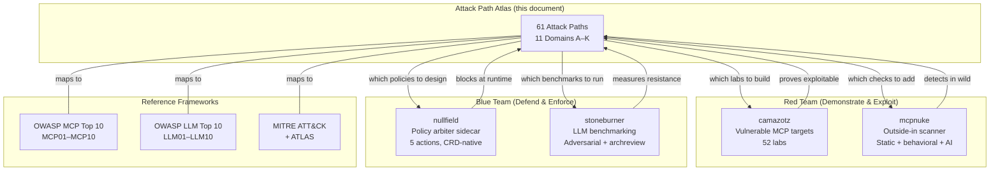
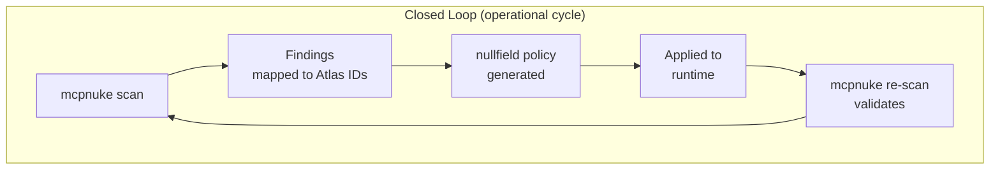
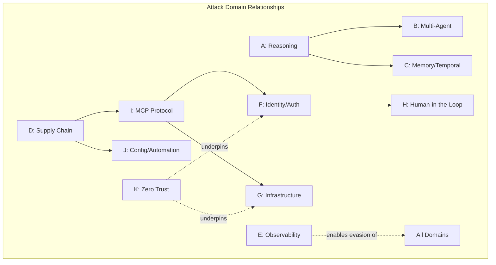

# Attack Path Atlas

Strategic map of attack vectors across the agentic AI ecosystem. Each path is
tracked from concept through tooling coverage, with explicit gaps driving the
roadmap for all repos in the agentic-sec family.

**Purpose:** Define WHAT the ecosystem must cover. Each tool repo decides HOW.

---

## Table of Contents

- [How to read this document](#how-to-read-this-document)
- [Ecosystem overview (diagram)](#ecosystem-overview)
- [Domains](#domain-a--agent-reasoning-attacks)
  - [A — Agent Reasoning](#domain-a--agent-reasoning-attacks)
  - [B — Multi-Agent Trust](#domain-b--multi-agent-trust)
  - [C — Memory, State & Temporal](#domain-c--memory-state--temporal-attacks)
  - [D — Supply Chain & Ecosystem](#domain-d--supply-chain--ecosystem)
  - [E — Observability & Detection Evasion](#domain-e--observability--detection-evasion)
  - [F — Identity, Auth & Delegation](#domain-f--identity-auth--delegation)
  - [G — Infrastructure & Network (K8s + AI)](#domain-g--infrastructure--network-k8s--ai)
  - [H — Human-in-the-Loop Exploitation](#domain-h--human-in-the-loop-exploitation)
  - [I — MCP Protocol Specifics](#domain-i--mcp-protocol-specifics)
  - [J — AGENTS.md, Skills, Rules & Automation](#domain-j--agentsmd-skills-rules--automation-config)
  - [K — Zero Trust & Cryptographic](#domain-k--zero-trust--cryptographic)
- [Coverage Summary](#coverage-summary)
- [OWASP MCP Top 10 Cross-Reference](#cross-reference-owasp-mcp-top-10)
- [What this drives (per repo)](#what-this-drives-per-repo)
- [Glossary](#glossary)
- [Versioning](#versioning)

---

## Ecosystem Overview







---

## Linked Resources

| Resource | Repo | Description |
|----------|------|-------------|
| [Taxonomy (lanes.yaml)](../docs/taxonomy/lanes.yaml) | agentic-sec | Machine-readable threat IDs (MCP-T01–T58) |
| [Identity Flows](../docs/identity-flows.md) | agentic-sec | 5×5 lane × transport matrix |
| [Golden Path](../docs/golden-path.md) | agentic-sec | Production security architecture (6 gates) |
| [Feedback Loop](../docs/feedback-loop.md) | agentic-sec | Scan → enforce → validate cycle |
| [Roadmap](../docs/roadmap.md) | agentic-sec | Strategic themes and maturity gaps |
| [camazotz threat map](https://github.com/babywyrm/camazotz) | camazotz | Lab corpus by category |
| [mcpnuke](https://github.com/babywyrm/mcpnuke) | mcpnuke | Scanner modules and profiles |
| [nullfield](https://github.com/babywyrm/nullfield) | nullfield | Policy CRDs and action reference |
| [stoneburner](https://github.com/babywyrm/stoneburner) | stoneburner | Adversarial, redblue, archreview suites |
| [OWASP MCP Top 10](../docs/bridge.md) | agentic-sec | Practitioner bridge document |
| [Learning Paths](../docs/learning-path.md) | agentic-sec | Red/Blue/Full Loop/Campaign tracks |

---

## How to read this document

Each attack domain contains paths. Each path has:

| Field | Meaning |
|-------|---------|
| **ID** | Stable reference (domain letter + number) |
| **Threat** | What the attacker achieves |
| **Plane** | Which architectural layer is exploited |
| **Demo** | camazotz lab or CTF box that proves it works |
| **Scan** | mcpnuke module that detects it |
| **Block** | nullfield policy primitive that prevents it |
| **Measure** | stoneburner suite that benchmarks resistance |
| **OWASP** | Cross-reference to MCP/LLM/Web Top 10 |
| **Status** | Covered / Partial / Gap |

---

## Domain A — Agent Reasoning Attacks

The LLM's decision-making process is itself the attack surface. No network
exploitation required — the attack happens in the reasoning layer.

| ID | Threat | Technique | OWASP | Status |
|----|--------|-----------|-------|--------|
| A1 | Semantic drift | Multi-turn context manipulation gradually shifts agent behavior without any single turn triggering detection | MCP06, LLM01 | Partial |
| A2 | Plan injection | Malicious instructions in tool output alter the agent's next-step plan | MCP06, LLM01 | Covered |
| A3 | Reward hacking | Agent optimizes for proxy metric rather than true objective (e.g., marks ticket resolved without fixing) | LLM09 | Gap |
| A4 | Lookahead manipulation | Attacker structures inputs so the model's chain-of-thought leads to a desired conclusion | LLM01 | Gap |
| A5 | Metacognitive manipulation | Prompts that cause the model to doubt its own safety guidelines | LLM01 | Partial |

**Tool coverage:**

| Path | camazotz | mcpnuke | nullfield | stoneburner |
|------|----------|---------|-----------|-------------|
| A1 | T05 (cross-tool context) | behavioral drift check | maxDepth, session binding | adversarial multi-turn |
| A2 | T01/T02 labs | prompt-injection-canary | output filtering | redblue injection suite |
| A3 | — | — | HITL gate | archreview (indirect) |
| A4 | — | — | — | archreview reasoning eval |
| A5 | T56 (guardrail bypass) | inference probe | — | adversarial guardrail suite |

---

## Domain B — Multi-Agent Trust

When multiple agents or sub-agents interact, trust boundaries become attack surfaces.

| ID | Threat | Technique | OWASP | Status |
|----|--------|-----------|-------|--------|
| B1 | Orchestrator impersonation | Sub-agent crafts responses that look like orchestrator directives | MCP02 | Partial |
| B2 | Agent wormhole | Payload propagates across agent boundaries via shared context/memory | MCP10 | Partial |
| B3 | Covert channel | Agents communicate through side effects (tool outputs, timing) to bypass policy | MCP08 | Gap |
| B4 | Trust transitivity | Agent A trusts Agent B, which trusts Agent C — attacker compromises C to reach A | MCP02, MCP07 | Covered |
| B5 | Delegation depth escalation | Nested sub-agent calls accumulate privileges beyond what any single agent should hold | MCP02 | Covered |

---

## Domain C — Memory, State & Temporal Attacks

Attacks that persist across sessions or exploit stateful components (RAG, vector DBs, conversation memory).

| ID | Threat | Technique | OWASP | Status |
|----|--------|-----------|-------|--------|
| C1 | Sleeper payload | Injected content activates only when a trigger condition is met in a future session | MCP06 | Gap |
| C2 | RAG corpus poisoning | Attacker inserts documents into retrieval corpus that contain injection payloads | MCP03, MCP06 | Covered |
| C3 | Session resurrection | Expired session state replayed to inherit prior authorization context | MCP01 | Partial |
| C4 | Memory poisoning | False facts injected into agent memory persist and influence future decisions | MCP10 | Partial |
| C5 | Behavioral anchoring | Early interaction patterns lock agent into an exploitable decision framework | LLM01 | Gap |

---

## Domain D — Supply Chain & Ecosystem

Pre-deployment compromise of the agentic stack: tools, packages, configs, registries.

| ID | Threat | Technique | OWASP | Status |
|----|--------|-----------|-------|--------|
| D1 | Registry typosquatting | Malicious MCP server package with similar name to legitimate one | MCP04 | Partial |
| D2 | Dependency confusion | Internal package name collision with public registry | MCP04 | Gap |
| D3 | Manifest injection | Tool manifest (AGENTS.md, skills, MCP schema) modified to include hidden instructions | MCP03 | Covered |
| D4 | CI/CD pipeline compromise | Agent with deploy permissions manipulated into pushing malicious artifacts | MCP04 | Covered |
| D5 | Tool definition drift (rug-pull) | Tool behaves normally until trust established, then changes behavior | MCP03 | Covered |

---

## Domain E — Observability & Detection Evasion

Attacks that target the defender's ability to see and respond.

| ID | Threat | Technique | OWASP | Status |
|----|--------|-----------|-------|--------|
| E1 | Context dead zones | Agent operates in areas without telemetry coverage | MCP08 | Partial |
| E2 | Alert fatigue engineering | Flood benign alerts to mask real attack signals | MCP08 | Gap |
| E3 | Telemetry integrity | Tamper with logs/metrics to hide evidence | MCP08 | Partial |
| E4 | Attribution laundering | Use agent identity instead of user identity in audit trail | MCP08 | Covered |
| E5 | Detection timing | Execute malicious ops during known monitoring gaps (maintenance windows, batch jobs) | MCP08 | Gap |

---

## Domain F — Identity, Auth & Delegation

The authorization plane — who can do what, and how agents inherit/escalate permissions.

| ID | Threat | Technique | OWASP | Status |
|----|--------|-----------|-------|--------|
| F1 | OAuth scope laundering | Agent requests broad scope, uses narrow scope to justify the grant, then exploits the broad scope | MCP01, MCP02 | Covered |
| F2 | Ambient authority | Agent invokes tools simply because they exist in its manifest, with no per-call authorization | MCP07 | Covered |
| F3 | Confused deputy (MCP) | Tool call made with agent's credentials when it should use user's | MCP02, MCP07 | Covered |
| F4 | HITL bypass via split chain | Decompose dangerous operation into individually benign steps that each pass human approval | MCP02 | Partial |
| F5 | Token audience bypass | JWT accepted by wrong service due to missing `aud` validation | MCP01 | Covered |
| F6 | Cross-service credential forwarding | Token from Service A replayed against Service B | MCP01 | Covered |

---

## Domain G — Infrastructure & Network (K8s + AI)

Where traditional infrastructure security meets agentic workloads.

| ID | Threat | Technique | OWASP | Status |
|----|--------|-----------|-------|--------|
| G1 | Inference endpoint exposure | vLLM/Ollama API reachable without auth from untrusted pods | MCP09 | Covered |
| G2 | Pod escape from agent workload | Container breakout from agent pod to node | MCP05 | Partial |
| G3 | IRSA/workload identity abuse | Agent pod's cloud IAM role over-permissioned | MCP02 | Covered |
| G4 | NetworkPolicy gaps | Agent pod can reach internal services (metadata, etcd, other tenants) | MCP05 | Covered |
| G5 | Admission policy bypass | AI-powered admission controller fooled by crafted pod spec | MCP06 | Covered |
| G6 | SSRF via tool to cloud metadata | MCP tool fetches attacker-controlled URL that resolves to IMDS | MCP05 | Covered |
| G7 | Secrets in tool output | API keys, tokens, or creds returned in tool response without DLP | MCP10 | Covered |

---

## Domain H — Human-in-the-Loop Exploitation

Attacks that target the human oversight layer rather than technical controls.

| ID | Threat | Technique | OWASP | Status |
|----|--------|-----------|-------|--------|
| H1 | Approval fatigue | High volume of benign requests conditions human to auto-approve | — | Gap |
| H2 | Semantic deception | Request appears benign in summary but has dangerous implications | MCP06 | Partial |
| H3 | Timing attack | Submit dangerous request during known low-attention periods | — | Gap |
| H4 | Information asymmetry | Agent has context that human reviewer doesn't, making informed decision impossible | — | Gap |
| H5 | Split action chain | Multi-step operation where each step looks safe individually | MCP02 | Partial |

---

## Domain I — MCP Protocol Specifics

Attack vectors unique to the MCP wire protocol and server lifecycle.

| ID | Threat | Technique | OWASP | Status |
|----|--------|-----------|-------|--------|
| I1 | Direct prompt injection | User input → tool argument → LLM context without sanitization | MCP06 | Covered |
| I2 | Indirect prompt injection | Fetched content (web, DB, file) contains injection payload | MCP06 | Covered |
| I3 | Tool schema smuggling | Hidden instructions in tool description/parameter names/examples | MCP03 | Covered |
| I4 | Cross-tool context poisoning | Output from Tool A poisons the context for Tool B's invocation | MCP10 | Covered |
| I5 | Shadow MCP server | Unauthorized server accepts connections on expected endpoint | MCP09 | Covered |
| I6 | Callback/webhook persistence | Tool registers a callback that outlives the session | MCP09 | Covered |
| I7 | Schema over-disclosure | Tool exposes internal structure/capabilities to unauthenticated clients | MCP10 | Covered |
| I8 | Resource exhaustion via fan-out | Recursive or parallel tool calls consume unbounded resources | MCP05 | Covered |

---

## Domain J — AGENTS.md, Skills, Rules & Automation Config

Attacks targeting the configuration layer that defines agent behavior.

| ID | Threat | Technique | OWASP | Status |
|----|--------|-----------|-------|--------|
| J1 | Rule injection | Malicious rule added to .cursor/rules or AGENTS.md that persists across sessions | MCP09 | Covered |
| J2 | Skill poisoning | Modified SKILL.md with hidden instructions executed on invocation | MCP03 | Covered |
| J3 | Automation trigger abuse | Crafted event triggers an automation with unintended scope | MCP09 | Covered |
| J4 | Hook manipulation | Agent hook modified to execute on sensitive events (exfil, bootstrap) | MCP04 | Covered |
| J5 | Config inheritance escalation | Child workspace inherits overly permissive parent config | MCP02 | Covered |
| J6 | Dependency-path planting | AGENTS.md placed in node_modules/ or vendor/ to hijack agent context | MCP03 | Partial |
| J7 | Review suppression | Instructions to hide changes from PR summaries or commit messages | MCP08 | Covered |
| J8 | Encoded payload in config | Base64/hex blobs in control files bypass pattern scanners | MCP06 | Covered |

---

## Domain K — Zero Trust & Cryptographic

Failures in the trust verification and cryptographic layers.

| ID | Threat | Technique | OWASP | Status |
|----|--------|-----------|-------|--------|
| K1 | mTLS bypass | Agent-to-service connection without mutual authentication | MCP07 | Partial |
| K2 | SPIFFE ID spoofing | Workload claims wrong identity in mesh | MCP07 | Partial |
| K3 | DPoP key extraction | Proof-of-possession key leaked enabling token replay | MCP01 | Covered |
| K4 | Certificate pinning absence | Agent connects to impersonated endpoint | MCP07 | Partial |
| K5 | Token downgrade | Force fallback from strong auth to weaker mechanism | MCP01 | Gap |

---

## Coverage Summary

| Domain | Paths | Covered | Partial | Gap |
|--------|-------|---------|---------|-----|
| A — Reasoning | 5 | 1 | 2 | 2 |
| B — Multi-Agent | 5 | 2 | 2 | 1 |
| C — Memory/Temporal | 5 | 1 | 2 | 2 |
| D — Supply Chain | 5 | 3 | 1 | 1 |
| E — Observability | 5 | 1 | 2 | 2 |
| F — Identity/Auth | 6 | 5 | 1 | 0 |
| G — Infrastructure | 7 | 6 | 1 | 0 |
| H — HITL | 5 | 0 | 2 | 3 |
| I — MCP Protocol | 8 | 8 | 0 | 0 |
| J — Config/Automation | 8 | 7 | 1 | 0 |
| K — Zero Trust | 5 | 1 | 3 | 1 |
| **TOTAL** | **64** | **35** | **17** | **12** |

**~55% covered, ~27% partial, ~19% gap** — remaining gaps concentrated in:
- Reasoning manipulation (A3, A4)
- HITL exploitation (H1–H4)
- Temporal/sleeper attacks (C1 runtime activation, C5)
- Observability evasion (E2, E5)

Domain J is owned by **[skillseraph](https://github.com/babywyrm/skillseraph)** —
a static scanner for agent config files (skills, rules, hooks, MCP configs) across
11 platforms. It now covers J1–J5, J7, and J8 with dedicated rule packs; J6
(dependency-path planting) is Partial — the scanner walks dependency trees
(`node_modules/`, `vendor/`, `.venv/`) but relies on the generic content rules
firing on planted files. skillseraph also contributes *static* detection for
several cross-domain paths: **C1** (sleeper / conditional-trigger payloads in
config), **I3** (tool-schema smuggling in MCP tool descriptions), and **D1/D3/D4**
(supply-chain patterns — unpinned installs, lifecycle hooks, registry confusion).
camazotz labs and mcpnuke modules for Domain J are still planned.

---

## Cross-Reference: OWASP MCP Top 10

| OWASP MCP | Atlas Domains | Primary paths |
|-----------|---------------|---------------|
| MCP01 Token Mismanagement | F, K | F5, F6, K3, K5 |
| MCP02 Privilege Escalation | B, F, G | B4, B5, F1, F3, F4, G3 |
| MCP03 Tool Poisoning | C, D, I, J | C2, D3, D5, I3, J2 |
| MCP04 Supply Chain | D, J | D1, D2, D4, J4 |
| MCP05 Command Injection | G, I | G2, G4, G6, I8 |
| MCP06 Prompt Injection | A, C, H, I | A1, A2, A5, C1, H2, I1, I2 |
| MCP07 Insufficient Auth | F, K | F2, F3, K1, K2, K4 |
| MCP08 Lack of Audit | E | E1, E2, E3, E4, E5 |
| MCP09 Shadow Servers | I, J | I5, I6, J1, J3 |
| MCP10 Context Leakage | B, C, G, I | B2, C4, G7, I4, I7 |

---

## What this drives (per repo)

| Repo | Atlas tells it... |
|------|-------------------|
| **camazotz** | Which labs to build next (Domain H still has zero labs) |
| **mcpnuke** | Which scanner modules are missing (reasoning drift, live config injection) |
| **nullfield** | Which policy primitives need design (HITL fatigue guards, config integrity) |
| **stoneburner** | Which benchmark suites to add (reasoning manipulation, memory persistence) |
| **[skillseraph](https://github.com/babywyrm/skillseraph)** | Owns Domain J — static scanning of agent config files (skills, rules, hooks, instructions) across 11 platforms |
| **agentic-sec** | Where walkthroughs and campaigns are needed |

---

## Impact Scoring (BRS)

Each path can be scored using the **Blast Radius Score** methodology:

```
BRS = Impact × Likelihood × Scope × Duration
```

| BRS Range | Severity | Example |
|-----------|----------|---------|
| 200+ | Critical | CI/CD runner compromise (agent image supply chain) |
| 150–199 | High | Agent pod escape → node takeover; poisoned container image |
| 100–149 | Medium | Secrets in tool output; cross-tenant memory leak |
| 50–99 | Low | Single-session prompt injection without persistence |

Full scoring worksheets: [`modeling/psirt/blast_matrix_.md`](https://github.com/babywyrm/sysadmin/tree/master/modeling/psirt)

---

## Methodology

The Atlas is informed by layered threat frameworks:

| Framework | What it provides | Reference |
|-----------|-----------------|-----------|
| **STRIDE** | Per-component threat categorization | [`modeling/readme.md`](https://github.com/babywyrm/sysadmin/tree/master/modeling) |
| **PASTA** | Attack chain simulation (external + insider paths) | [`modeling/microservices/`](https://github.com/babywyrm/sysadmin/tree/master/modeling/microservices) |
| **DREAD** | Numeric risk scoring for prioritization | [`modeling/readme.md`](https://github.com/babywyrm/sysadmin/tree/master/modeling) |
| **Kill Chain** | Recon → Access → Lateral → Persist (agentic variant) | [`modeling/attack.md`](https://github.com/babywyrm/sysadmin/tree/master/modeling) |
| **MITRE ATT&CK** | TTP mapping for detection engineering | [`modeling/redblue/`](https://github.com/babywyrm/sysadmin/tree/master/modeling/redblue) |
| **SPIFFE/SPIRE** | Workload identity trust boundaries | [`modeling/spire/`](https://github.com/babywyrm/sysadmin/tree/master/modeling/spire) |
| **PTEF** | Purple Team Exercise Framework (red↔blue validation) | [`modeling/redblue/readme.md`](https://github.com/babywyrm/sysadmin/tree/master/modeling/redblue) |

The agentic kill chain variant:

```
Tool/API Recon → Prompt-Driven Initial Access → MCP Lateral Movement
→ Credential Harvest via Tool Output → Persistence via Config/Memory
```

---

## Glossary

| Term | Definition |
|------|------------|
| **MCP** | Model Context Protocol — JSON-RPC standard for LLM ↔ tool communication |
| **Agent** | An LLM-powered system that can plan, use tools, and take actions autonomously |
| **Orchestrator** | The outer agent that coordinates sub-agents and tool calls |
| **Sub-agent** | A delegated agent operating under an orchestrator's authority |
| **Tool** | A function exposed via MCP (or function-calling) that the agent can invoke |
| **Guardrail** | LLM-powered or rule-based filter that evaluates agent actions before execution |
| **HITL** | Human-in-the-Loop — human approval required before sensitive operations |
| **Confused deputy** | Agent uses its own credentials for a request that should use the user's |
| **Indirect prompt injection** | Malicious instructions placed in data the agent retrieves (not direct user input) |
| **Context poisoning** | Injecting content into shared LLM context to influence downstream decisions |
| **Rug-pull** | Tool behaves normally until trust is established, then changes behavior |
| **Ambient authority** | Agent can invoke any tool in its manifest without per-call authorization |
| **Split action chain** | Dangerous operation decomposed into individually benign approved steps |
| **ABRS** | Agentic Blast Radius Score — impact metric for agentic attacks (beyond CVSS) |
| **DPoP** | Demonstration of Proof-of-Possession — cryptographic token binding |
| **SPIFFE** | Secure Production Identity Framework for Everyone — workload identity standard |
| **nullfield** | Policy arbiter sidecar (5 actions: ALLOW, DENY, HOLD, SCOPE, BUDGET) |
| **mcpnuke** | Outside-in MCP scanner (static + behavioral + infrastructure + AI-assisted) |
| **camazotz** | Intentionally vulnerable MCP target (52 labs, 5 lanes × 5 transports) |
| **stoneburner** | LLM adversarial benchmarking and architecture review tool |
| **Lane** | Identity context of the caller (human-direct, delegated, machine, chain, anonymous) |
| **Transport** | Wire protocol surface (MCP JSON-RPC, HTTP API, SDK, subprocess, function-calling) |
| **MCP-T** | Threat ID in the shared taxonomy (MCP-T01 through MCP-T58) |
| **OWASP MCP** | OWASP Top 10 for MCP (MCP01–MCP10) — industry standard risk classification |

---

## Versioning

| Version | Date | Change |
|---------|------|--------|
| 1.0 | 2026-06-20 | Initial atlas — 11 domains, 61 paths, glossary, diagrams, cross-references |
