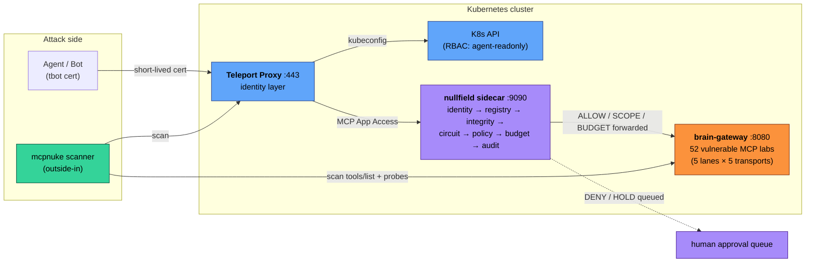

# Ecosystem Architecture — Defending MCP at Scale

This document is for security engineers evaluating how to secure Model Context
Protocol (MCP) tool execution in production Kubernetes environments. It explains
the architecture, the defense layers, how to test them, and what to present to
your security review board.

> **Read first:** [The Identity Flow Framework](identity-flows.md) is the
> foundational lens this document is written through. The "defense layers"
> below correspond to the lane × transport matrix defined there: nullfield is
> the per‑cell policy enforcer, Teleport handles Lane 3 (and Lane 4
> partially), ZITADEL handles Lanes 1 and 2, and mcpnuke validates every
> cell.

---

## The Problem

MCP connects AI models to real tools — database queries, deployments, credential
brokers, webhook registrations. Every `tools/call` is a function invocation with
side effects, triggered by an LLM that cannot be trusted to make authorization
decisions.

The attack surface is not theoretical. Camazotz demonstrates 52 distinct
vulnerability patterns spanning five agentic-identity lanes and five transport
surfaces (A=MCP, B=Direct API, C=in-process SDK, D=subprocess, E=native LLM
function-calling — see [ADR 0001](https://github.com/babywyrm/camazotz/blob/main/docs/adr/0001-five-transport-taxonomy.md))
— from prompt injection that triggers secret exfiltration, to
confused-deputy attacks where the AI grants admin access because the attacker
wrote a convincing justification. These attacks work because:

1. **LLM guardrails are advisory, not enforceable.** The model can warn about a
   dangerous action in its reasoning while the underlying tool logic executes it.
2. **Static API keys provide no identity.** You cannot distinguish a human
   operator from a compromised agent from a replayed token.
3. **Tool execution has no policy layer.** Without an arbiter, any registered
   tool call is forwarded to the upstream server unconditionally.

The defense stack described here addresses all three.

---

## The Defense Layers

### Layer 1: nullfield — The Arbiter

[nullfield](https://github.com/babywyrm/nullfield) is a sidecar proxy that
intercepts every MCP `tools/call` and makes a decision before forwarding. Five
actions define what nullfield can do with a tool call:

| Action | What Happens | Example |
|--------|-------------|---------|
| **ALLOW** | Forward immediately | Read-only status checks |
| **DENY** | Reject immediately | Exfiltration tools, unregistered tools |
| **HOLD** | Park for human approval | Production deployments, agent delegation |
| **SCOPE** | Allow but modify in transit | Strip secrets from args, redact response PII |
| **BUDGET** | Allow but enforce quotas | Per-identity call limits, token cost caps |

These compose. A single request can be budget-checked, scoped, held for approval,
then forwarded. The policy is expressed in YAML (or as a Kubernetes CRD) and
evaluated top-to-bottom, first match wins, default deny.

**Where it sits:**

```
MCP Client → nullfield (:9090) → brain-gateway (:8080)
                ↓
         decision chain:
         identity → registry → integrity → circuit → policy → budget → audit
```

nullfield adds ~2ms to the request path. It runs as a sidecar container, a
standalone gateway, or is auto-injected via a mutating admission webhook
(`nullfield.io/inject: "true"`).

**What it solves:** Even if the LLM is compromised or manipulated, the policy
layer enforces hard boundaries. The AI cannot override a DENY rule.

### Layer 2: Teleport — Machine Identity

[Teleport](https://goteleport.com) provides cryptographic identity for agents
and workloads. Instead of static API keys or long-lived service account tokens,
agents authenticate with short-lived X.509 certificates issued by Teleport's
auth service.

**How it works:**

1. `tbot` runs alongside the agent (as a sidecar or standalone deployment).
2. tbot authenticates to the Teleport auth service using its Kubernetes
   ServiceAccount JWT — no shared secrets.
3. Teleport issues a short-lived certificate (1-hour TTL, auto-renewed every
   20 minutes) that carries the agent's identity and roles.
4. The agent uses this certificate to access K8s resources (via kubeconfig) or
   MCP servers (via Teleport App Access).

**What it solves:** Every agent action is tied to a cryptographic identity.
Certificates expire automatically. Roles are enforced server-side. The audit
trail shows exactly which bot accessed which resource and when.

**How it complements nullfield:** Teleport handles *who can connect*. nullfield
handles *what they can do once connected*. Teleport says "this agent has the
`agent-mcp` role and can reach the MCP server." nullfield says "this agent can
call `cost.check_usage` but not `secrets.leak_config`, and it's limited to 20
calls per hour."

### Layer 3: mcpnuke — Automated Validation

[mcpnuke](https://github.com/babywyrm/mcpnuke) is a security scanner purpose-built
for MCP servers. It performs three types of analysis:

**Static analysis** — examines tool definitions, schemas, and metadata for
dangerous patterns (credential parameters, execution capabilities, webhook
registration, supply chain risks) without calling any tools.

**Behavioral probes** — calls tools with safe payloads and analyzes responses
for injection vectors, credential leakage, temporal inconsistencies, and
cross-tool manipulation.

**Infrastructure checks** — probes the surrounding infrastructure for
misconfigurations. The Teleport-aware checks discover proxy endpoints, flag
self-signed certificates, test for unauthenticated app enumeration, check
tbot credential exposure, and flag over-privileged bot service accounts.

**Exploit chain automation** — for environments running camazotz with the
Teleport labs, mcpnuke chains the lab tools into complete attack sequences:

| Chain | Steps | What It Tests |
|-------|-------|---------------|
| Bot identity theft | Read tbot secret → replay cert → check session binding | MCP-T18: credential theft and replay |
| Role escalation | Get roles → request escalation → privileged operation | MCP-T28: RBAC bypass via social engineering |
| Cert replay | Get expired cert → replay in grace window → check detection | MCP-T19: short-lived cert revocation gap |

Each chain reports whether the attack succeeded (finding) or the defense held
(info). On easy difficulty, attacks succeed. On hard difficulty, nullfield's
session binding, HOLD gates, and replay detection block them.

---

## How the Layers Interact



The key insight: **defense in depth is testable**. You deploy nullfield and
Teleport as the defense. You deploy camazotz as the vulnerable target. You run
mcpnuke to prove the defenses work. If mcpnuke's exploit chains produce
CRITICAL findings on hard difficulty, your policy has gaps. If they produce
INFO findings ("defense held"), you're in good shape.

### Layer 5: agentic-bootstrap — CTF Inference Orchestration

> *Local POC — not yet public.*

agentic-bootstrap solves a different problem: **how to run the same CTF VM
against different LLM backends without rebuilding the image**. Each machine
(Warbird, Hammerhand, future boxes) has AI-gated attack surfaces — prompt
injection targets, deployment security gates, log redaction layers — and the
model powering those gates directly affects solvability and difficulty.

**Architecture:**

```
machine.yaml    ─── HOW to wire a box (static: k8s patches, env vars, systemd)
                    never changes when models or endpoints swap
profile.yaml    ─── WHERE to call (swappable: endpoint IP, port, default model)
                    brainbox.yaml → lab Ollama, cloud-brain.yaml → GCP GPU
bootstrap.sh    ─── generic dispatcher: reads both, applies patches via SSH
                    refuses incompatible model+machine combos (exit 2)
tests/*.sh      ─── per-machine solvability validation: sweeps every LLM gate
                    across a model lineup, reports PASS/FAIL/SOLVABILITY_BROKEN
```

**What validation has shown (Warbird, 6 models):** model choice creates a
difficulty spectrum. The `ops_assistant` prompt-injection gate leaks the
agent secret on 5/5 strategies with `qwen3.5:0.8b` (easy) but only 1/5
with `qwen2.5:7b` (hard). The `deploy_war` structural gate holds on 5 of
6 models but `qwen3:4b` breaks it entirely — its chain-of-thought reasoning
leaks into verdict text, defeating the `startswith("APPROVED")` parser and
making the box unsolvable. That model is flagged `incompatible` and the
bootstrap refuses to deploy it.

**What it solves:** CTF platform operators select a difficulty tier when
spawning a VM, the bootstrap wires the inference layer accordingly, and
the solvability tests guarantee the box remains winnable.

### The Lane View — `/lanes` UI + `/api/lanes` JSON contract

Camazotz ships two parallel views over the 52 labs: `/threat-map` groups
by attack category, **`/lanes` groups by identity lane** (Lane 1 Human
Direct → Lane 5 Anonymous, with the per-lane flow diagram, default
nullfield action, covering mcpnuke checks, and coverage gaps inline).
The same data is exposed as a stable machine-readable contract at
`GET /api/lanes` (schema `v1`) and is the surface
`mcpnuke --coverage-report <camazotz-url>` consumes to emit cross-project
coverage reports. The lane slugs (`human-direct`, `delegated`, `machine`,
`chain`, `anonymous`) and transport codes (`A`–`E`) in that response are
the ecosystem's shared vocabulary — nullfield policies key on them, and
mcpnuke findings carry them as fields. If they ever change in camazotz,
the other two repos must move in lockstep.

---

## Per-Project Coverage Scorecard

What each project covers today, and what it deliberately leaves to the others.
This is the honest boundary of the ecosystem as of 2026-05-19.

| Project | Covers | Does not cover | Source of truth |
|---------|--------|----------------|-----------------|
| **[camazotz](https://github.com/babywyrm/camazotz)** | 52 labs across all 5 identity lanes and 5 transport surfaces (A=MCP, B=Direct API, C=in-process SDK, D=subprocess, E=native LLM function-calling). Parallel browsing via `/threat-map` (by attack category) and `/lanes` (by identity flow). | Runtime enforcement, live detection of attacker traffic, policy generation. Camazotz is the *target*, not a defense. | `GET /api/lanes` schema v1, `scenario.yaml` per lab |
| **[nullfield](https://github.com/babywyrm/nullfield)** | Per-tool-call policy enforcement: ALLOW / DENY / HOLD / SCOPE / BUDGET. Identity verification (JWT/cert). Session binding. Response redaction. Budget accounting. | Scanning for new vulnerabilities, generating initial policies from scratch, IDP issuance, long-term audit storage. | `NullfieldPolicy` CRD; per-lane starter templates (spec 2026-04-26) |
| **[mcpnuke](https://github.com/babywyrm/mcpnuke)** | Static, behavioral, infrastructure, and exploit-chain scanning of MCP servers. Policy recommendation (`--generate-policy`). Teleport-aware checks. Per-lane reporting (spec 2026-04-26). | Runtime request blocking (that's nullfield's job). Identity issuance. Deployment. | Finding dataclass; `--json` output |
| **[agentic-sec](https://github.com/babywyrm/agentic-sec)** | The shared vocabulary — lane slugs, transport codes, threat taxonomy, golden-path architecture. Cross-project walkthroughs. | Any implementation. It is strictly documentation. | `docs/identity-flows.md` |
| **[stoneburner](https://github.com/babywyrm/stoneburner)** | Agentic token usage benchmarking — compares LLM providers (Claude, OpenAI, Bedrock, Ollama, **brain-gateway**) on cost, throughput, latency, and accuracy with LLM-as-judge scoring. The `brain-gateway` provider routes benchmarks through camazotz's MCP inference endpoint, enabling comparative analysis of the same workload across camazotz-managed providers. | MCP protocol enforcement, vulnerability scanning, policy. Stoneburner is for cost/performance measurement, not security. | Benchmark results JSON; `atomics compare --narrative` |
| **agentic-bootstrap** *(local POC, not yet public)* | CTF VM inference bootstrapping — decouples the LLM inference layer from VM images so machines can be booted against any endpoint and model. Per-machine wiring specs (`machine.yaml`), swappable inference profiles, model compatibility enforcement with incompatibility refusal, and per-machine solvability test suites that validate attack-chain integrity across models. | Not a security tool. Handles operational wiring of CTF lab VMs to inference backends (Ollama on local hardware, cloud GPU hosts). | `machine.yaml` per VM, `profiles/*.yaml` per backend, `tests/*.sh` per machine |

**Transport matrix status** (surfaced by camazotz `/api/lanes` as
machine-readable `gaps`):

The 5×5 transport matrix is substantially complete as of 2026-05-15.
Lanes 2 and 4 have full A–E coverage. Lane 5 has 6 labs on Transport A
(the anonymous pre-auth surface). Remaining gaps are Lane 1 D/E and
Lane 3 E — intentional boundaries of the current corpus, not bugs.

---

## Roadmap — How This Grows

Three horizons, committed in decreasing order of near-term certainty.

### Shipped

- ✅ nullfield per-lane policy templates + three new primitives (`identity.requireActChain`, `delegation.maxDepth`, `identity.audienceMustNarrow`) — *2026-04-26*
- ✅ mcpnuke `--by-lane` and `--coverage-report` — *2026-04-26*
- ✅ nullfield CRD watcher + active-policy bridge — *2026-04-27*
- ✅ Five-transport taxonomy (D = subprocess, E = native LLM function-calling) ratified in camazotz ADR 0001 — *2026-04-28*
- ✅ `sdk_tamper_lab` (Lane 1 / Transport C), `subprocess_lab` (Lane 3 / Transport D), `function_calling_lab` (Lane 2 / Transport E) — *2026-04-28/29*
- ✅ mcpnuke `--coverage N`, `--diff-baseline`, `--profile` — *2026-05-03*
- ✅ Campaign scenario system (`make campaign SCENARIO=...`) + four pre-authored NullfieldPolicy CRDs — *2026-05-03*
- ✅ `ai_governance_bypass_lab` (MCP-T41, Lane 2 / Transport A), `shared_idp_pollution_lab` (MCP-T42, Lanes 1+2 / Transport A), `dpop_forgery_lab` (MCP-T43, Lane 3 / Transport A), `blocklist_bypass_lab` (MCP-T44, Lane 2 / Transport A) — *2026-05-10*
- ✅ `agent_chain_direct_api_lab` (MCP-T45, Lane 4 / Transport B) — fills Lane 4 / Transport B gap — *2026-05-10*
- ✅ mcpnuke DPoP enforcement check (RFC 9449, three probes, Lane 3 / Transport A) — *2026-05-10*
- ✅ nullfield `scope.request.blockRedirects` primitive (MCP-T41 defense) — *2026-05-10*
- ✅ `delegated_sdk_lab` (MCP-T46, Lane 2 / Transport C) — fills Lane 2 / Transport C gap — *2026-05-10*
- ✅ `agent_sdk_chain_lab` (MCP-T47, Lane 4 / Transport C) — fills Lane 4 / Transport C gap — *2026-05-10*
- ✅ mcpnuke Spring Actuator Phase 2 exploitation probes (heapdump, env/logger POST write, shutdown gating) — *2026-05-10*
- ✅ Campaign 5: Enterprise AI-Ops (`docs/campaigns/enterprise-ai-ops.md`) — MCP-T42/T43/T44/T46/T47 chain — *2026-05-10*
- ✅ Walkthrough 10: Token Cross-Pollution and Shared Identity (`docs/walkthroughs/token-cross-pollution.md`) — MCP-T42/T43 — *2026-05-10*
- ✅ `agent_subprocess_chain_lab` (MCP-T48, Lane 4 / Transport D) — subprocess env credential injection — *2026-05-10*
- ✅ `agent_llm_chain_lab` (MCP-T49, Lane 4 / Transport E) — LLM function-calling context leak — *2026-05-10*
- ✅ **Lane 4 fully complete** across all five transports (A/B/C/D/E) — *2026-05-10*
- ✅ Walkthrough 11: Building a Lane 4 Defense from Scratch (`docs/walkthroughs/lane4-defense.md`) — *2026-05-10*
- ✅ `anon_schema_harvest_lab` (MCP-T50, Lane 5 / Transport A) — anonymous tool schema over-disclosure — *2026-05-12*
- ✅ `anon_rate_exhaust_lab` (MCP-T51, Lane 5 / Transport A) — anonymous rate-limit exhaustion, no per-caller accounting — *2026-05-12*
- ✅ `preauth_injection_lab` (MCP-T52, Lane 5 / Transport A) — pre-auth input injected before identity established, inherited by session — *2026-05-12*
- ✅ **Lane 5 purpose-built labs complete** — *2026-05-12*

- ✅ **Okta identity provider support** in camazotz — `OidcIdentityProvider` base class extracted, `OktaIdentityProvider` and `ZitadelIdentityProvider` as subclasses, provider-agnostic lab wiring (`is_live_idp()`), `make up-okta` compose profile, 5 Okta flow tests — *2026-05-15*
- ✅ **nullfield v0.9** — tool lifecycle management with rug-pull detection (`pkg/registry/lifecycle.go`), response inspection pipeline, per-identity cost attribution — *2026-05-15*
- ✅ `shell_exec_wrap_lab` (MCP-T53, Lane 3 / Transport D) — shell command wrapping injection; MCP tool calls `subprocess.run(user_input, shell=True)`, not simulated. 14 tests. Lab count 51 → 52. — *2026-05-15*
- ✅ mcpnuke `shell_injection` check — Transport D behavioral probe with 5 metacharacter injection categories and dangerous base command probes. 18 tests. — *2026-05-15*
- ✅ Central machine-readable taxonomy at `agentic-sec/docs/taxonomy/lanes.yaml` — drift enforced by `test_agentic_sec_taxonomy_in_sync` in camazotz — *2026-05-12*

### Near-term (actively worked)

- Auth0 identity provider alongside ZITADEL and Okta for Lane 1/2 coverage (same `OidcIdentityProvider` base, thin subclass)

### Future (revisit when the vocabulary drifts)

- Per-lane rate-limit primitives in nullfield (distinct from global `maxCallsPerMinute`)
- mcpnuke `--watch` mode producing continuous lane-coverage deltas against a long-running camazotz target

### Horizon: Direct CLI Agent Pattern (no MCP layer)

A growing production pattern in platform engineering and DevOps: LLM agents
that call CLI tools directly via subprocess — `gh`, `jira`, `kubectl`, `helm`,
`terraform`, `aws-cli`, `gcloud` — **without any MCP server in the path**.
The agent is given a `run_command` function or a system prompt that describes
what CLI tools it can use. No `tools/list`. No JSON schema validation. No
nullfield enforcement point. The LLM constructs command strings and the
subprocess runs them.

This is Transport D without the MCP wrapper, and it represents a genuinely
different threat model:

- **No protocol-level enforcement point** — nullfield cannot intercept a subprocess call
- **No schema boundary** — the agent constructs the command string itself; injection is in the string, not a JSON field
- **Irreversible blast radius** — `gh pr merge`, `kubectl delete namespace`, `jira transition CLOSE` run immediately with no undo
- **Sparse audit trail** — CI job logs capture stdout, not a structured trace with principal, tool, and arguments
- **Prompt injection via data** — injected instructions in a PR description, Jira ticket, or ConfigMap cause the agent to run attacker-controlled CLI commands

Planned work when this pattern becomes common enough to warrant systematic coverage:

1. **`shell_exec_wrap_lab`** (MCP-T53, Transport D) — ✅ Shipped 2026-05-15. MCP tool that actually calls `subprocess.run(user_input, shell=True)`; not simulated. mcpnuke behavioral probe sends `; id` and gets real output. Teaching point: the MCP layer was fine — the vulnerability is one level down; nullfield cannot save you.

2. **mcpnuke Transport D behavioral probing** — ✅ Shipped 2026-05-15. Dedicated `shell_injection` check that detects subprocess-wrapping tools by schema signals (`exec`, `run`, `shell`, `command` in name/description; `cmd`, `argv`, `query` as param names) and sends targeted shell injection probes: `` `id` ``, `$(whoami)`, `; sleep 3` (timing-based), `&&echo INJECTED`. Findings tagged `transport: D` with elevated severity when timing or output confirms real execution.

3. **`beyond-mcp.md` expansion** — full side-by-side comparison of the same injection attack against Transport A (MCP `tools/call`), Transport D (LangChain `ShellTool` / direct subprocess), and Transport E (OpenAI/Anthropic function-calling). Same input, three different blast radii and three different defense strategies.

**Trigger:** right-size this work when real incidents surface (`computer_use`, AutoGen code execution, k8s agents with `kubectl` in-PATH) or when the team needs to demo to an audience building platform-engineering AI bots rather than MCP servers. The scaffolding is already in place — Transport D is in the taxonomy, `CODE_EXEC_PATTERNS` is in mcpnuke, `beyond-mcp.md` is the hook.

---

## The Teleport Labs — What They Teach

Three camazotz labs specifically test Teleport machine identity patterns:

### Bot Identity Theft (`bot_identity_theft_lab`, MCP-T18)

**Attack:** A tbot agent writes short-lived certificates to a Kubernetes Secret.
If that secret is readable by other pods (misconfigured RBAC), an attacker
extracts the certificate and replays it to access MCP tools as the bot.

**What varies by difficulty:**
- Easy: Secret is mounted into all pods. Cert replay succeeds. Flag captured.
- Medium: Secret requires RBAC exploit. Cert replay succeeds if serial matches.
- Hard: Secret is inaccessible. Even if obtained, nullfield session binding
  detects the identity mismatch and denies the call.

**Golden path defense:** Scope tbot secrets to specific pods via RBAC.
Enable nullfield `integrity.bindToSession` to catch identity swaps.

### Role Escalation (`teleport_role_escalation_lab`, MCP-T28)

**Attack:** The bot has `agent-readonly` but discovers an MCP tool that modifies
role assignments. By crafting a convincing justification, it social-engineers
the LLM into approving an escalation to `agent-ops`.

**What varies by difficulty:**
- Easy: LLM approves any justification. Escalation succeeds. Privileged op executes.
- Medium: LLM requires an approved incident ticket. Social engineering with
  ticket reference succeeds.
- Hard: All escalation requests are held for human approval via nullfield's
  HOLD action. The bot cannot self-escalate.

**Golden path defense:** Never expose role modification as a tool. Use nullfield
HOLD on any tool that changes permissions. Teleport CE roles are static — use
Enterprise access requests for just-in-time elevation.

### Certificate Replay (`cert_replay_lab`, MCP-T19)

**Attack:** A short-lived certificate has expired, but clock skew between the
proxy and the application creates a grace window. The attacker replays the
expired cert within this window.

**What varies by difficulty:**
- Easy: Gateway accepts expired certs unconditionally. Replay succeeds.
- Medium: 30-second grace window. Certs expired < 30s ago are accepted.
- Hard: Expired certs rejected immediately. Replay detection flags the reused
  cert ID.

**Golden path defense:** Strict NTP sync across all nodes. Enable nullfield
`integrity.detectReplay` to catch reused credential identifiers. Short cert
TTLs (1 hour) limit the replay window.

---

## For Your Security Review

When presenting this to your architecture review board or CISO:

**The threat model:** MCP tool execution is remote procedure invocation
triggered by an AI. The AI is not a security boundary — it can be manipulated
by prompt injection, confused-deputy attacks, and social engineering. Every
tool call needs an independent policy decision.

**The defense:** nullfield provides that policy layer (five actions, YAML-based,
CRD-native). Teleport provides the identity layer (short-lived certs, no static
secrets, full audit). Together they implement the golden path: every request
carries identity, every tool is registered and scoped, every secret lives in a
secret manager, and the AI's output is never trusted as authorization.

**The validation:** camazotz provides 52 intentionally vulnerable labs
covering every OWASP MCP Top 10 risk and every one of the five
agentic-identity lanes. mcpnuke automates the attack sequences and
reports whether your defenses hold. Run mcpnuke on hard difficulty — if the
exploit chains fail and defenses hold, your golden path is working.

**What remains manual:** policy authoring (deciding which tools get ALLOW vs
HOLD vs DENY), role design (which agents get which Teleport roles), and
incident response runbooks (what to do when mcpnuke finds a gap).

---

## Getting Started

| Goal | Start Here |
|------|-----------|
| Understand the vulnerability patterns | [Camazotz Quick Start](https://github.com/babywyrm/camazotz/blob/main/QUICKSTART.md) — run the labs locally |
| Add the policy layer | [nullfield README](https://github.com/babywyrm/nullfield) — deploy as sidecar |
| Add machine identity | [Teleport Setup](teleport/setup.md) — step-by-step Teleport integration |
| Scan and validate | [mcpnuke README](https://github.com/babywyrm/mcpnuke) — `mcpnuke --targets http://localhost:8080/mcp` |
| Benchmark providers | [stoneburner](https://github.com/babywyrm/stoneburner) — `atomics run --provider brain-gateway` |
| Wire a CTF VM to an inference backend | agentic-bootstrap — `bootstrap.sh machines/warbird profiles/brainbox.yaml` |
| Production architecture | [Golden Path v3](golden-path.md) — the complete security spec |
