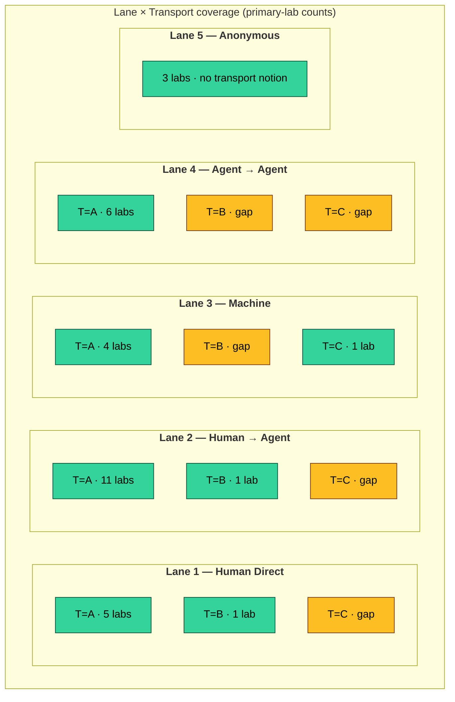

# The Identity Flow Framework

> **Status:** Foundational reference. Every new lab, policy, scanner check, and
> integration in this ecosystem must declare which **lane** and which
> **transport** it targets.

This is the framework that gives shape to every other document in the
agentic-security hub. It separates the problem space into five **identity
lanes** and three **transport layers**, then maps every existing tool —
camazotz labs, nullfield actions, mcpnuke checks, Teleport, ZITADEL — into the
resulting matrix. New work picks a cell. Defenses cover their cell. Tests prove
their cell holds.

The framework is grounded in the relevant IETF and OASIS specifications so
that anything we build can be reviewed against real standards rather than
ad‑hoc assumptions about how AI agents authenticate.

---

## Table of Contents

1. [Why a Framework](#why-a-framework)
2. [The Five Identity Lanes](#the-five-identity-lanes)
3. [The Three Transport Surfaces](#the-three-transport-surfaces)
4. [The Lane × Transport Matrix](#the-lane--transport-matrix)
5. [Standards Adherence Per Lane](#standards-adherence-per-lane)
6. [Tool Coverage Map](#tool-coverage-map)
7. [Threat Surface Per Lane](#threat-surface-per-lane)
8. [Testing & Validation Matrix](#testing--validation-matrix)
9. [Using the Framework](#using-the-framework)
10. [Glossary](#glossary)

---

## Why a Framework

Most AI/agent security writing collapses into one of two failure modes:

1. **Treat every agent as a human.** Bolt OIDC onto a chatbot, give it the
   user's bearer token, and call it secure. This is a confused-deputy
   accelerator.
2. **Treat every agent as a service.** Issue a long‑lived API key, assume
   "machine‑to‑machine," and ignore that the agent is being driven by an LLM
   that can be socially engineered.

Real agentic deployments are neither. A single tool call may begin with a
human in a browser, traverse one or more delegated agents, terminate at an MCP
server, and ultimately hit a database via direct HTTP. The identity story
changes at each hop, and so do the controls.

The framework solves that by forcing every component to answer two questions:

- **Which lane is the *initiator*?** Who, in identity terms, started this
  request?
- **Which transport carries the call right now?** MCP JSON‑RPC? REST? An
  in‑process function call inside the agent's own SDK?

Once those two questions are answered, the right RFCs, the right nullfield
action, the right mcpnuke check, and the right camazotz lab fall out
deterministically.

---

## The Five Identity Lanes

Each lane describes *who or what is on the other end of the credential*. Lanes
are mutually exclusive at a given hop, but a request can change lanes as it
moves through the system (and that is itself a control surface).

### Lane 1 — Human Direct

```text
[Person] ──(OIDC + MFA)──▶ [MCP / API / UI]
```

A human authenticates directly to the resource. No agent in the path.

- **Identity carrier:** OIDC ID token + access token (RFC 6749, 7636 PKCE).
- **Session:** Browser cookie or DPoP‑bound bearer (RFC 9449).
- **Audit unit:** `sub` is a real user.
- **Where it shows up:** Operators using the camazotz portal, security engineers
  poking the MCP endpoint with `curl --user`, ZITADEL admin console.

### Lane 2 — Human → Agent (Delegated)

```text
[Person] ──(OIDC)──▶ [Agent runtime] ──(token‑exchange / on‑behalf‑of)──▶ [MCP]
```

A human authorizes an agent to act for them. The agent is not the user, but
its calls *carry* the user's authorization, ideally as a downscoped token.

- **Identity carrier:** OAuth 2.0 Token Exchange (RFC 8693), with
  `actor_token` representing the agent and `subject_token` the human.
- **Audience scoping:** RFC 8707 Resource Indicators bind the exchanged token
  to a specific MCP server.
- **Session:** Short TTL, ideally DPoP‑bound to the agent's key.
- **Audit unit:** Both `sub` (human) and `act` (agent) appear in claims.
- **Where it shows up:** Cursor / Claude Code calling MCP on a developer's
  behalf, the ZITADEL device‑code flow used by agent CLIs, Camazotz's
  `oauth_delegation_lab` and `delegation_chain_lab`.

### Lane 3 — Machine Identity (Autonomous)

```text
[Bot/CI/Workload] ──(SPIFFE / X.509 / mTLS)──▶ [MCP / K8s / API]
```

No human is in the loop at request time. The caller is a workload with its
own cryptographic identity.

- **Identity carrier:** Short‑lived X.509 (Teleport `tbot`, SPIFFE/SPIRE),
  mTLS, or workload‑identity JWT bound to a Kubernetes ServiceAccount.
- **Issuance:** Attestation against the orchestrator (Kubernetes
  `TokenReview`, AWS IRSA, GCP Workload Identity).
- **Audit unit:** Workload SPIFFE ID or Teleport bot name.
- **Where it shows up:** mcpnuke when run from CI, nullfield when calling its
  own controller, Teleport `tbot` issuing certs to camazotz lab pods,
  scheduled scans, GitOps reconcilers.

### Lane 4 — Agent → Agent (Delegation Chain)

```text
[Human] ──▶ [Agent A] ──▶ [Agent B] ──▶ [Agent C] ──▶ [MCP]
```

Multiple agents in series. Each step is a delegation. Authority erodes (or
should erode) with depth, and the audit chain must remain intact.

- **Identity carrier:** Recursive RFC 8693 token exchange, each hop adding to
  the `act` chain. Or signed delegation tokens (ad‑hoc, but should follow
  GNAP‑style chained authorization).
- **Depth bound:** Policy decision — typically a hard cap at depth 3.
- **Audit unit:** Full chain `sub → act → act → act` preserved end to end.
- **Where it shows up:** Camazotz `delegation_depth_lab` and
  `delegation_chain_lab`, nullfield's HOLD action on `delegation.invoke_agent`,
  mcpnuke's chain‑depth findings.

### Lane 5 — Anonymous

```text
[Caller] ──(no credential)──▶ [Public surface]
```

No identity. By definition, not a security boundary — but unavoidable at
discovery endpoints, health checks, and the first packet of any OAuth dance.

- **Identity carrier:** None. Source IP and TLS‑level identifiers only.
- **Audit unit:** IP + UA + correlation ID.
- **Where it shows up:** `/.well-known/oauth-protected-resource`,
  `/healthz`, MCP server's pre‑auth `initialize` handshake, every camazotz
  endpoint on Easy difficulty.
- **Required posture:** Read‑only, idempotent, rate‑limited, never reflects
  user input into a privileged context.

---

## The Three Transport Surfaces

> **⚠️ Update 2026-04-28 — Transport dimension extended from 3 to 5 codes.**
>
> The body of this section (covering A, B, C) remains accurate but is
> incomplete. Two new codes have been ratified in the canonical taxonomy
> (`camazotz/frontend/lane_taxonomy.py::TRANSPORT_DEFINITIONS`):
>
> - **D — Subprocess / native binary** (agent spawns `kubectl`/`terraform`
>   as a child process; identity envelope = OS process tree)
> - **E — Native LLM function-calling, non-MCP** (OpenAI tools, Anthropic
>   `tool_use`, Gemini function-calling; identity envelope = third-party
>   model-provider trust boundary)
>
> The full rewrite of this section — including the expanded 5×5 matrix and
> per-transport RFC anchors — is pending validation via two spike labs
> (`subprocess_lab`, `function_calling_lab`). Decision record:
> [camazotz ADR 0001](https://github.com/babywyrm/camazotz/blob/main/docs/adr/0001-five-transport-taxonomy.md).
>
> Existing labs/policies/findings tagged `A`/`B`/`C` remain valid; no
> migration is required for existing work.

Transport is *how* the call physically reaches the resource. The same lane
behaves differently across transports because each transport has a different
identity envelope.

### Transport A — MCP (JSON‑RPC over HTTP/SSE/stdio)

The protocol our ecosystem is built around.

- **Identity envelope:** `Authorization: Bearer …` header, plus
  `mcp-session-id` for session continuity. With Teleport App Access, mTLS at
  the proxy plus a Teleport‑minted JWT to the upstream.
- **Notable wrinkle:** `tools/call` carries arbitrary tool args, which become
  a *secondary identity surface* (think `username` arg passed by the LLM).
  nullfield's SCOPE action exists exactly because of this.
- **Discovery:** `tools/list`, `prompts/list`, `resources/list` — all
  pre‑auth on the MCP wire (Anonymous lane), but the underlying server may
  require auth.

### Transport B — Direct API (REST / gRPC / GraphQL)

The resources MCP servers themselves call: databases, cloud providers, the
Kubernetes API, GitHub, internal microservices.

- **Identity envelope:** Whatever the upstream requires — bearer tokens,
  IAM‑signed requests, mTLS, basic auth.
- **Notable wrinkle:** This is where *identity laundering* happens. An
  agent's identity must not silently become a service identity at this hop;
  the call must remain attributable to the original lane.
- **Where it lives:** Inside the MCP server's tool implementation. Camazotz
  emulates these (cloud, secrets, db) so nullfield can reason about them
  without real upstream blast radius.

### Transport C — SDK / In‑Process

The code path that exists *inside* the agent runtime, before any wire protocol
is involved. Function calls into a Python/TS library, a `tool_call` resolved
by the model SDK, a vector‑store query.

- **Identity envelope:** Whatever the process holds in memory — env vars,
  file‑mounted tokens, short‑lived creds from a credential helper.
- **Notable wrinkle:** This is where prompt injection wins or loses. If the
  SDK trusts the LLM's output as authorization (e.g., it just passes
  `args["role"] = "admin"` straight through), no downstream control can
  recover.
- **Where it lives:** Cursor / Claude Code / OpenAI Assistants tool runtime,
  any agent built directly on a model SDK, and the Python/Go test harnesses
  in our repos.

---

## The Lane × Transport Matrix

> **⚠️ The matrix below shows 5 lanes × 3 transports.** As of 2026-04-28
> the transport dimension is 5 codes (`A`/`B`/`C`/`D`/`E`); the table
> here will be expanded to 5×5 once the spike labs for D and E ship.
> See the banner under "The Three Transport Surfaces" above.

The cell labels are the *primary control surface* — what enforces identity at
that intersection.

| Lane ↓ / Transport →             | **A. MCP**                                   | **B. Direct API**                                | **C. SDK / In‑Process**                          |
|----------------------------------|----------------------------------------------|--------------------------------------------------|--------------------------------------------------|
| **1. Human Direct**              | OIDC bearer + DPoP, MCP session              | OIDC bearer to upstream                          | Local browser + cookie, dev token in env         |
| **2. Human → Agent (Delegated)** | Token exchange (8693) + Resource Ind. (8707) | On‑behalf‑of token, downscoped                   | SDK passes user token, never claims it           |
| **3. Machine Identity**          | Teleport bot cert / SPIFFE JWT               | mTLS, IAM workload identity                      | Mounted SA token, credential helper              |
| **4. Agent → Agent**             | Chained token exchange, depth‑bounded        | Same chained token, audience pinned per hop      | SDK `act` propagation, never re‑claim `sub`      |
| **5. Anonymous**                 | Discovery + healthz only                     | Public read endpoints (rate‑limited)             | Process boot, before any cred is loaded          |

> **Reading the matrix:** Each cell is a *state*, not a tool. A request in
> cell (3, A) — a Teleport bot calling MCP — needs different controls than a
> request in cell (4, A) — a delegated chain calling MCP. Conflating them is
> the bug.

---

## Standards Adherence Per Lane

Anything in this ecosystem that authenticates anyone MUST justify itself
against these specs. This is the per‑lane checklist.

### Lane 1 — Human Direct

| RFC / Spec | Role |
|------------|------|
| **RFC 6749** OAuth 2.0 | Authorization Code + PKCE flow for browser‑based clients |
| **RFC 7636** PKCE | Mandatory; no public client without it |
| **RFC 8252** OAuth for Native Apps | Loopback redirect for desktop clients |
| **RFC 9068** JWT Profile for Access Tokens | Validate `iss`, `aud`, `exp`, `nbf`, `sub` |
| **RFC 7662** Token Introspection | Revocation check at the resource server when needed |
| **RFC 9449** DPoP | Sender‑constrained tokens; defeats bearer theft |
| **OIDC Core 1.0** | ID token, `nonce`, `at_hash` validation |

### Lane 2 — Human → Agent

| RFC / Spec | Role |
|------------|------|
| **RFC 8693** OAuth 2.0 Token Exchange | The agent exchanges the user token for a downscoped one carrying `actor_token` |
| **RFC 8707** Resource Indicators | Token audience bound to the specific MCP server, not the whole org |
| **RFC 9449** DPoP | Bind the exchanged token to the *agent's* key, not the user's |
| **RFC 8628** Device Authorization Grant | Acceptable bootstrap when the agent has no browser |
| **RFC 7662** Introspection | Resource server verifies `act` and `scope` at use time |

### Lane 3 — Machine Identity

| Spec | Role |
|------|------|
| **SPIFFE / SPIRE** | Workload identity document (SVID), X.509 or JWT |
| **RFC 8705** Mutual‑TLS Client Authentication | When the upstream is HTTPS |
| **RFC 9068** JWT Profile | Workload JWTs validated like any other access token |
| **Kubernetes `TokenReview`** | SA token attestation at the issuer |
| **Teleport Machine ID** | Concrete implementation: short‑lived X.509 from `tbot` |

> **Anti‑pattern:** Static API keys checked into a Kubernetes Secret with no
> rotation. If you find one, it's a finding regardless of how locked down the
> RBAC is.

### Lane 4 — Agent → Agent

| Spec | Role |
|------|------|
| **RFC 8693** Token Exchange (recursive) | Each hop preserves and extends the `act` chain |
| **RFC 8707** Resource Indicators | Audience MUST narrow at each hop, never widen |
| **GNAP** (RFC 9635, in progress) | Reference model for richer chained delegation |
| **Custom: depth bound** | Policy decision — recommended max depth 3, configurable |
| **Custom: chain integrity** | Each hop signs the previous chain; tamper = DENY |

### Lane 5 — Anonymous

| Spec | Role |
|------|------|
| **RFC 8414** OAuth Authorization Server Metadata | What the discovery endpoint returns |
| **RFC 9728** OAuth Protected Resource Metadata | `WWW-Authenticate` + `resource_metadata` URL |
| **RFC 6585** HTTP 429 | Rate limiting required on all anonymous surfaces |

---

## Tool Coverage Map

This is where each project in the ecosystem actually lives.

### nullfield — Per‑Lane Default Actions

| Lane | Default Action | Typical Rule |
|------|---------------|--------------|
| 1. Human Direct | ALLOW + audit | Per‑user BUDGET on cost‑bearing tools |
| 2. Human → Agent | SCOPE + audit | Strip secrets from args, redact responses, BUDGET per `act` |
| 3. Machine Identity | ALLOW for read, HOLD for write | DENY anything not in the bot's role tool list |
| 4. Agent → Agent | HOLD past depth=2, DENY past depth=3 | `delegation.invoke_agent` always HOLD |
| 5. Anonymous | DENY (default deny) | ALLOW only `tools/list`, `initialize`, `/healthz` |

### mcpnuke — Per‑Lane Check Coverage

| Lane | Existing Checks | Status |
|------|----------------|--------|
| 1. Human Direct | OIDC discovery, scope analysis, token introspection probe | ✅ |
| 2. Human → Agent | `oauth_delegation_lab` exploit chain, audience confusion checks | ✅ |
| 3. Machine Identity | Teleport `proxy_discovery`, `cert_validation`, `bot_overprivilege` | ✅ |
| 4. Agent → Agent | `delegation_chain_lab` chain, depth findings | 🟡 partial — depth metric needs hardening |
| 5. Anonymous | Pre‑auth tool enumeration, health‑endpoint info disclosure | ✅ |

### camazotz — Per‑Lane Lab Coverage

Complete distribution across all 32 labs. The `T` column is the primary
transport surface each lab targets (A = MCP JSON‑RPC, B = Direct HTTP
API, C = SDK/library). `+N` in "Secondary" means that lab's *also* a
touchpoint on another lane.



Green = lab exists. Amber = gap flagged by
`camazotz /api/lanes` as a teaching artifact — a known boundary of the
corpus, not a bug.

| Lane | T=A (MCP) | T=B (Direct API) | T=C (SDK) | Secondary |
|------|-----------|------------------|-----------|-----------|
| **1. Human Direct** (6) | `auth_lab`, `rbac_lab`, `tenant_lab`, `notification_lab`, `temporal_lab` | `secrets_lab` | — | — |
| **2. Human → Agent** (12) | `oauth_delegation_lab`, `revocation_lab`, `pattern_downgrade_lab`, `credential_broker_lab`, `context_lab`, `comms_lab`, `audit_lab`, `indirect_lab`, `budget_tuning_lab`, `policy_authoring_lab`, `response_inspection_lab` | `egress_lab` | — | `delegation_chain_lab` (from L4), `relay_lab` (from L4) |
| **3. Machine Identity** (5) | `bot_identity_theft_lab`, `teleport_role_escalation_lab`, `cert_replay_lab`, `config_lab` | — | `supply_lab` | `credential_broker_lab` (from L2) |
| **4. Agent → Agent** (6) | `delegation_chain_lab`, `delegation_depth_lab`, `hallucination_lab`, `relay_lab`, `attribution_lab`, `cost_exhaustion_lab` | — | — | `bot_identity_theft_lab` (from L3) |
| **5. Anonymous** (3) | `tool_lab`, `shadow_lab`, `error_lab` | — | — | — |

**Transport coverage gaps** (surfaced by `/api/lanes` as machine-readable
`gaps` fields — a teaching artifact, not a bug):

- **Lane 1**: no Transport C lab yet (no SDK-level direct-human flow).
- **Lane 2**: no Transport C lab yet.
- **Lane 3**: no Transport B lab yet (no machine-identity-over-direct-API).
- **Lane 4**: no Transport B or C lab yet (agent chains today are all
  MCP-transport in this corpus).
- **Lane 5** has no transport notion by design (anonymous pre-auth).

These are blind spots worth filling as the lab catalog grows; they also
define the honest boundary of what camazotz currently teaches.

#### Browsing the coverage

The camazotz portal ships two parallel views of the same 32 labs:

- `GET /threat-map` — lab grid organized by *attack category* (best for
  learners asking "what kind of attack is this?").
- `GET /lanes` — lab grid organized by *identity lane* (best for
  practitioners asking "who is the actor in this flow?"). A sticky
  jump bar anchors to each of the five lanes; each strip shows the
  flow diagram, default nullfield action, covering mcpnuke checks, and
  coverage gaps inline.

#### Machine‑readable taxonomy: `GET /api/lanes`

The portal also publishes the full taxonomy as JSON, versioned as
`schema: "v1"`:

```bash
curl -s http://<camazotz-host>:3000/api/lanes | jq '.schema, .lanes | length, .coverage."4".gaps'
# "v1"
# 5
# [
#   "Transport B not covered",
#   "Transport C not covered"
# ]
```

The schema is the intended contract surface for sibling tools:

- **mcpnuke** consumes `/api/lanes` for its `--coverage-report` flag to
  intersect its finding catalog with the camazotz lane distribution.
- **nullfield** policies reference the same lane slugs
  (`human-direct`, `delegated`, `machine`, `chain`, `anonymous`) and
  transport codes (`A`/`B`/`C`) via the `nullfield.io/lane` and
  `nullfield.io/transport` policy labels.

Do not rename the slugs without updating the three consumer projects
in lockstep — they are the ecosystem's shared vocabulary.

### Identity Providers / Issuers

| Component | Lanes Served | Notes |
|-----------|-------------|-------|
| **ZITADEL** | 1, 2 | OIDC IdP for humans and delegated agents; runs in‑cluster |
| **Teleport (CE)** | 3, 4 (partial) | Machine ID via `tbot`, K8s + App Access; CE has no JIT access requests |
| **Kubernetes API** | 3 | Issues SA tokens validated by Teleport's `kubernetes` join |
| **(Future) SPIRE** | 3, 4 | Considered for native SPIFFE if we outgrow Teleport CE |

---

## Threat Surface Per Lane

What goes wrong, mapped to the OWASP MCP Top 10 (LLM05/06 numbering used by
camazotz finding IDs).

| Lane | Primary Threats | Camazotz Threat IDs |
|------|----------------|---------------------|
| 1. Human Direct | Token theft, session fixation, MFA bypass | MCP-T04, MCP-T11 |
| 2. Human → Agent | Confused deputy, audience confusion, downscoping bypass, prompt injection re‑authoring `args` | MCP-T01, MCP-T02, MCP-T05 |
| 3. Machine Identity | Cert exfiltration, replay, over‑privileged service accounts, supply chain | MCP-T04, MCP-T08, MCP-T26 |
| 4. Agent → Agent | Identity dilution, chain forgery, infinite delegation, depth bombs | MCP-T07, MCP-T20 |
| 5. Anonymous | Tool enumeration, info disclosure, DoS, indirect injection seed | MCP-T03, MCP-T09, MCP-T10 |

---

## Testing & Validation Matrix

This is the answer to: *"how do we know the controls hold?"*

| Lane | Attack tool | Defense tool | Validation |
|------|-------------|--------------|------------|
| 1 | mcpnuke `--oidc-url` flow probes | nullfield identity check | Re‑scan post‑policy: token‑theft findings → INFO |
| 2 | mcpnuke delegation chain probe | nullfield SCOPE rule on delegated tools | `oauth_delegation_lab` flag uncapturable on Hard |
| 3 | mcpnuke Teleport exploit chains | Teleport role + nullfield session binding | `bot_identity_theft_lab` → defense held on Hard |
| 4 | mcpnuke chain‑depth check + `delegation_depth_lab` | nullfield HOLD past depth=2 | LLM cannot self‑escalate; HOLD queue receives request |
| 5 | mcpnuke pre‑auth tool listing | nullfield default DENY + WAF rate limit | `tools/list` empty for unauthenticated callers |

The closed‑loop script (`scripts/feedback-loop.sh`) currently exercises lanes
1, 2, 3, 5 end‑to‑end. Lane 4 has its own dedicated walkthrough
(`docs/walkthroughs/delegation-chains.md`) because the depth signal is the
defense itself, not just a finding.

---

## Using the Framework

**When proposing a new camazotz lab,** declare in the lab's `README`:

```yaml
identity_lane: 3            # Machine Identity
transport: A                # MCP
threat_ids: [MCP-T04]
hard_difficulty_defense:    # what blocks the attack on Hard
  - nullfield: integrity.bindToSession
  - teleport: cert_ttl_short
```

**When adding a new nullfield rule template,** label it:

```yaml
metadata:
  labels:
    nullfield.io/lane: "agent-to-agent"
    nullfield.io/transport: "mcp"
```

**When writing a new mcpnuke check,** the check's docstring includes:

```python
"""
Lane: 2 (Human → Agent)
Transport: A (MCP)
Validates: RFC 8693 actor_token presence, RFC 8707 audience scoping
"""
```

**When writing a walkthrough,** open with the lane and transport so the
reader knows immediately which control surface they're in.

That alignment — lane/transport declared up front — is what makes the
ecosystem composable. A new lab in cell (4, A) automatically slots into the
delegation walkthrough, gets covered by the existing chain‑depth nullfield
rule, and is exercised by the existing mcpnuke chain probe.

---

## Glossary

| Term | Meaning in this framework |
|------|---------------------------|
| **Lane** | The identity story of the *initiator* of a request |
| **Transport** | The wire / process surface carrying the request right now |
| **Hop** | One transition along the path, possibly changing transport but never silently changing lane |
| **Identity laundering** | Anti‑pattern: a request changes lane (e.g., from delegated to machine) without policy approval |
| **Depth** | Number of agent‑to‑agent delegations between the human and the resource |
| **Cell** | A (lane, transport) pair; the unit of test coverage |
| **act / sub** | OAuth 2.0 Token Exchange claims naming the *acting* identity vs the *subject* identity |

---

## Where to Go Next

- [Ecosystem Architecture](ecosystem.md) — the three projects from a defense
  point of view.
- [The Feedback Loop](feedback-loop.md) — scan → recommend → enforce →
  validate, using the lanes implicitly.
- [Delegation Chain Walkthrough](walkthroughs/delegation-chains.md) — Lane 4
  in depth.
- [Teleport Setup](teleport/setup.md) — Lane 3 in depth.
- [Golden Path](golden-path.md) — Lane 1 + Lane 2 production blueprint.
